<p align="center">
  
</p>

<h3 align="center"><b>J</b>WST <b>A</b>nalysis of <b>L</b>ine <b>E</b>mission with <b>B</b>ayesian <b>I</b>nference</h3>

<p align="center">
Simultaneous LTE slab fitting of the molecular emission in JWST/MIRI spectra of protoplanetary disks:<br>
continuum → molecule detection → joint fit of many molecules → MCMC posteriors and degeneracies,<br>
plus line maps and velocity maps of IFU cubes (jets, winds, H₂) with region-by-region slab fits,<br>
and rotation diagrams of H₂, CO, OH and H₂O (N, T, A_V, ortho/para ratio, optical depth),<br>
from the terminal, from Python, or in an interactive web app.
</p>

<p align="center">
  <a href="#installation">Install</a> ·
  <a href="#five-minute-tour">Tour</a> ·
  <a href="#the-physics">Physics</a> ·
  <a href="#fitting-and-uncertainties">Fitting</a> ·
  <a href="#line-maps-and-velocity-maps-from-ifu-cubes">Cube maps</a> ·
  <a href="#rotation-diagrams">Rotation diagrams</a> ·
  <a href="#configuration-reference">Config</a> ·
  <a href="#command-line-reference">CLI</a> ·
  <a href="#examples">Examples</a> ·
  <a href="#references">References</a>
</p>

---

A jalebi is a spiral of fried batter soaked in syrup. The inner-disk spectrum MIRI records is a spiral of
its own: hundreds of thousands of water lines, with the Q-branches of CO₂, HCN and C₂H₂ and bands of a
dozen other molecules tangled on top, all soaked in the dust continuum. JALEBI untangles it. It models
every molecule as a local-thermodynamic-equilibrium (LTE) slab, fits all of them **at the same time** to the
continuum-subtracted spectrum (so overlapping bands compete for the same flux), and samples the joint
posterior, so you see the uncertainties **and** the degeneracies between parameters and between molecules.

| | |
| --- | --- |
| **Input** | JWST pipeline Level-3 `x1d` files (all 12 MRS sub-bands, kept separate), `s3d` cubes (aperture extraction), or any CSV |
| **Continuum** | 7 methods (IRSQR, median + Savitzky–Golay, ASLS, convex hull, rolling minimum, clicked spline anchors, Banzatti+2025 line-free windows), Q-branch protection, model-aware refinement |
| **Model** | LTE slabs on a fine ln λ grid → MIRI line-spread function → pixel integration. Opacity groups, isotopologue ties, radial temperature gradients (annuli), per-component line lists (HITRAN / HITEMP) |
| **Molecules** | H₂O, CO₂, ¹³CO₂, CO, ¹³CO, C₂H₂, ¹³CCH₂, HCN, H¹³CN, OH, CH₄, NH₃, C₂H₄, C₂H₆, C₄H₂, HC₃N, H₂ bundled (27 MB); anything in HITRAN downloadable; custom `.par` lists importable (e.g. C₆H₆) |
| **Fitting** | grid over (log N, T) → differential evolution → `emcee`, with emitting areas solved exactly by non-negative least squares; parallel over CPU cores |
| **Diagnostics** | autocorrelation time, split-R̂, acceptance; corner plots, correlation matrix, traces, posterior predictive; τ_max flags; ΔBIC detection test; automatic molecule detection |
| **Cubes** (`jalebi.cube`) | per-spaxel continuum, point-source removal with the continuum as PSF, moment maps, Gaussian-centroid velocity maps with Monte Carlo errors, line stacking, channel maps, PV cuts, regions → spectrum → slab fit; FITS with WCS (CARTA/DS9) + PNG |
| **Rotation diagrams** (`jalebi.rotdiag`) | pick a molecule (H₂, CO, OH, H₂O, …): its lines are found in the spectrum, blends and contaminants flagged, fluxes measured with exact errors; one or two temperatures or a power law, A_V with a choice of extinction curves, the ortho-to-para ratio (exact spin-resolved partition sums), optical depth; least squares + MCMC in flux space, BIC model comparison, mass and column of warm gas |
| **Interfaces** | `jalebi` CLI, Panel web app (`jalebi serve`) with three modules (LTE slab fit · Cube maps · Rotation diagram), Python API, batch mode for surveys |
| **Batteries** | FZ Tau MIRI spectrum, HV Tau C cube cutouts, synthetic spectra with known answers (disk, absorber, H₂), 12 example scripts, a notebook, `jalebi doctor`, `jalebi demo`, `jalebi cube demo`, `jalebi rotdiag demo` |

<p align="center">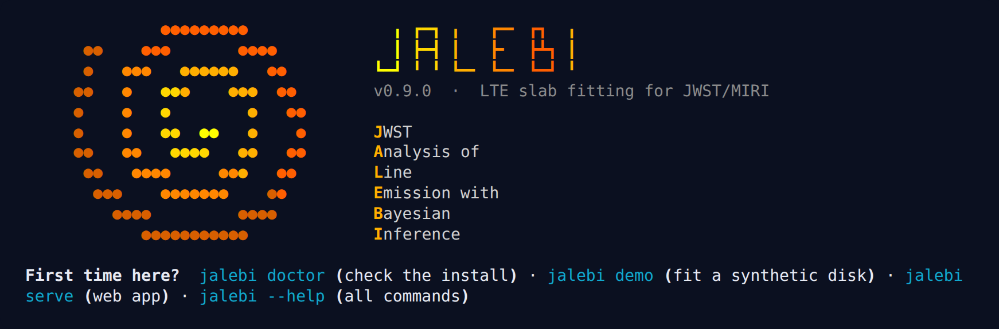</p>

---

## Contents

1. [Installation](#installation)
2. [Five-minute tour](#five-minute-tour)
3. [The physics](#the-physics): slabs, opacity, radiative transfer, the instrument, many components, absorption screens
4. [Degeneracies: what a slab fit can and cannot tell you](#degeneracies-what-a-slab-fit-can-and-cannot-tell-you)
5. [Data preparation](#data-preparation): input, continuum, masks, noise
6. [Fitting and uncertainties](#fitting-and-uncertainties): likelihood, priors, the three stages, diagnostics
7. [Which molecules? Automatic detection](#which-molecules-automatic-detection)
8. [Line maps and velocity maps from IFU cubes](#line-maps-and-velocity-maps-from-ifu-cubes) (`jalebi.cube`)
9. [Rotation diagrams](#rotation-diagrams) (`jalebi.rotdiag`)
10. [Configuration reference](#configuration-reference)
11. [Command-line reference](#command-line-reference)
12. [The web app](#the-web-app)
13. [Python API](#python-api)
14. [Parallelisation and speed](#parallelisation-and-speed)
15. [Line lists](#line-lists)
16. [Examples](#examples) · [Output files](#output-files) · [Validation](#validation)
17. [Project layout](#project-layout) · [Versions and releases](docs/VERSION_CONTROL.md) · [Citing](#citing-jalebi) · [License](#license) · [References](#references)

---

## Installation

JALEBI needs Python ≥ 3.10. The CI workflow tests Linux and macOS with Python 3.10–3.14 (before the first
release it was run by hand on Linux with Python 3.11 and 3.14). Windows should work (use `install.bat`;
the process pools then start with *spawn*, which is slower to start) but is not yet tested.

### The interactive installer (recommended)

```bash
git clone https://github.com/shridharanbaskaran/jalebi.git
cd jalebi
python install.py            # or: bash install.sh   ·   install.bat on Windows
```

The installer uses only the standard library, so it runs before anything else is installed. It walks
through seven steps and shows every command before running it:

| Step | What happens |
| --- | --- |
| 1. **Checking the kitchen** | Python version, pip, conda/mamba, CPU cores, RAM, free disk, internet access, PEP 668 "externally managed" system Pythons |
| 2. **Choosing the pan** | a new **conda** environment (Python 3.12 from conda-forge; no Anaconda `defaults` terms-of-service prompt), a new **virtual environment**, or **this Python**. An existing environment of the same name is updated, not recreated |
| 3. **Picking the toppings** | optional extras: `app` (web app), `fetch` (HITRAN downloads), `notebook` (Jupyter + a *Python (JALEBI)* kernel), `jwst` (STScI pipeline), `dev` (tests, lint, build) |
| 4. **Counting the ingredients** | every requirement in the target environment: ✔ present, ✘ missing, ↑ too old |
| 5. **Frying** | `pip install -e ".[extras]"`: pip adds only what is missing. A spinner shows molecular fun facts, and the full pip output goes to `install_log.txt` |
| 6. **Soaking in syrup** | `jalebi doctor`: imports, line lists and partition functions, example data, a model-speed benchmark |
| 7. **Taste test** | optional: fits the bundled synthetic disk in about a minute |

Non-interactive and scripted use:

```bash
python install.py --yes                                       # all defaults, no questions
python install.py --env conda --name jalebi --extras app,fetch,notebook
python install.py --env venv --venv .venv --extras app
python install.py --env current --no-editable                 # into the active environment, regular install
python install.py --check                                     # report what is missing; change nothing
python install.py --dry-run                                   # print the commands only
```

<p align="center">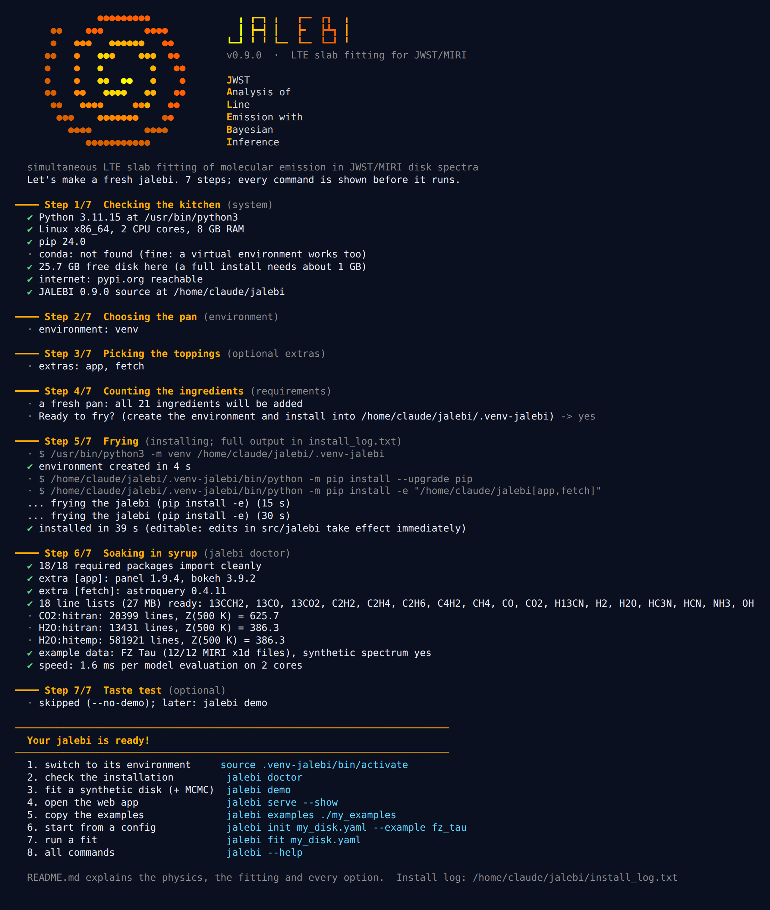</p>

### With pip or conda directly

```bash
pip install .                         # core
pip install ".[app,fetch]"            # + web app and HITRAN downloads
pip install -e ".[all,dev]"           # editable, everything a developer needs

conda env create -f environment.yml   # conda-forge environment "jalebi" with the app and fetch extras
conda activate jalebi
```

Once JALEBI is on PyPI, `pip install jalebi` works too; the wheel carries the line lists, the example
data and the example scripts.

### Check an installation: `jalebi doctor`

```text
$ jalebi doctor
JALEBI v0.12.0  JWST Analysis of Line Emission with Bayesian Inference
Required packages
  ✔ numpy          2.4.6        (>= 1.24)  arrays
  ...
Line lists
  ✔ 18 lists, 27.3 MB — user cache ~/.jalebi/linedata
  ✔ CO2:hitran    20399 lines, Z(500 K) = 625.7     [line-list table]
  ✔ H2O:hitran    13431 lines, Z(500 K) = 386.3     [TIPS-2021 via HAPI (M=1, I=1)]
  ✔ H2O:hitemp   581921 lines, Z(500 K) = 386.3     [line-list table]
Example data
  ✔ FZ Tau x1d files: 12/12, synthetic spectrum: yes
Speed
  ✔ 1.8 ms per model (HITEMP H2O + CO2, 520 pixels, 34841 fine-grid points)
  Your jalebi is ready.
```

`python -m jalebi.doctor` works even when dependencies are missing: it lists them and prints the `pip`
command that fixes them. `jalebi doctor --json` gives a machine-readable report.

### Requirements

| Package | Minimum | Used for |
| --- | --- | --- |
| numpy, scipy, pandas | 1.24, 1.11, 2.0 | arrays; sparse operators, NNLS, differential evolution; tables |
| astropy | 5.3 | FITS, units, coordinates |
| pyarrow | 14 | Parquet line-list cache |
| PyYAML, pydantic | 6.0, 2.5 | validated YAML configurations |
| emcee, corner | 3.1, 2.2 | MCMC sampling, corner plots |
| matplotlib | 3.7 | figures |
| pybaselines | 1.1 | IRSQR and ASLS continua |
| joblib, threadpoolctl | 1.3, 3.0 | parallel grids and batches, one BLAS thread per worker |
| h5py | 3.8 | MCMC checkpoints |
| typer, rich, tqdm | 0.9, 13, 4.66 | command line, terminal output, progress bars |
| hitran-api (HAPI) | 1.2 | TIPS-2021 partition functions (offline) and HITRAN downloads |
| *app:* panel, bokeh | 1.4, 3.4 | web app |
| *fetch:* astroquery | 0.4.7 | HITRAN queries |
| *notebook:* jupyterlab, ipykernel, ipympl | 4.0, 6.25, 0.9 | notebooks |
| *jwst:* jwst | 1.16 | reducing MIRI data yourself (optional, large) |
| *dev:* pytest, ruff, build, twine | | tests, lint, packaging |

The single source of truth is `src/jalebi/_requirements.py`. The tests check that `pyproject.toml` and
`requirements.txt` agree with it.

---

## Five-minute tour

```bash
jalebi                         # banner + the commands to start with
jalebi doctor                  # is everything in place?
jalebi demo                    # fit the bundled synthetic disk: grid → optimiser → MCMC, compare with the truth
jalebi examples ./my_examples  # copy the example scripts, configs and notebook
jalebi serve --show            # the web app, opened on the bundled FZ Tau and synthetic spectra
```

Your own target, from the terminal:

```bash
jalebi init my_disk.yaml --example fz_tau   # a working config (it points at the bundled FZ Tau data)
# edit target.path (a folder of Level3_ch*_x1d.fits), distance_pc, rv_kms and the components
jalebi prep   my_disk.yaml                  # continuum + masks  -> results/.../prep.png
jalebi detect my_disk.yaml --write my_disk_detected.yaml    # which molecules are there?
jalebi fit    my_disk.yaml --stages grid,optimise           # quick look (minutes)
jalebi fit    my_disk.yaml --processes 16 --nsteps 20000    # full posterior
```

From Python:

```python
from jalebi.config import ProjectConfig
from jalebi.pipeline import run_pipeline

cfg = ProjectConfig.load("my_disk.yaml")
run = run_pipeline(cfg)                       # prep -> grid -> optimise -> mcmc -> results/
print(run.mcmc.summary())                     # medians and 16/84 % of every parameter, plus derived ones
```

Fit of the bundled synthetic disk (true parameters known; see [Validation](#validation)):

<p align="center">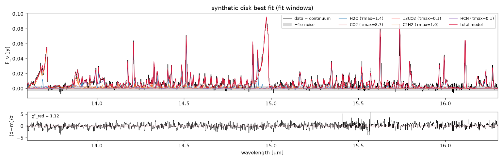</p>

---

## The physics

JALEBI describes the gas in the inner disk as one or more **slabs**: homogeneous columns of molecules in
LTE at temperature $T$, with column density $N$, seen face-on over an emitting area $A = \pi R^2$ (so $R$
is the radius of an equivalent disk, not a physical ring). This is the model behind most Spitzer and JWST
molecular analyses (Carr & Najita 2008; Salyk et al. 2011; the MINDS and JDISCS programmes). Its
strength is that three numbers per molecule, $(N, T, R)$, reproduce thousands of lines. Its limits are
discussed [below](#degeneracies-what-a-slab-fit-can-and-cannot-tell-you).

Units everywhere: wavelength λ in µm, $N$ in cm⁻², $T$ in K, $R$ in au, flux density $F_\nu$ in Jy.

### 1. Level populations in LTE

For a transition $u \to l$ with upper-level degeneracy $g_u$ and energies $E_u$, $E_l$ (in K, i.e. $E/k$),
the fraction of molecules in level $u$ is

$$
\frac{N_u}{N} = \frac{g_u \, e^{-E_u/T}}{Q(T)},
$$

where $Q(T)$ is the partition function. JALEBI takes $Q(T)$ from the table shipped with a line list
when there is one, and otherwise from **TIPS-2021** (Gamache et al. 2021) through HAPI, offline. The
line lists store $A_{ul}$, $g_u$, $g_l$, $E_u$ and $E_l$, and line strengths are computed from them, not from
HITRAN's $S(296\,\mathrm{K})$. That way isotopologue columns stay physical: no terrestrial-abundance
factor is folded in.

### 2. Line opacity and optical depth

The velocity-integrated opacity per molecule of line $l$ (m³ s⁻¹ with λ in m; including stimulated emission) is

$$
\kappa_l(T) = \frac{A_{ul}\, g_u\, \lambda_l^3}{8\pi\, Q(T)} \left( e^{-E_l/T} - e^{-E_u/T} \right),
$$

and the optical depth at velocity offset $v$ from the line centre is $\tau_l(v) = N\,\kappa_l(T)\,\phi(v)$,
with a Gaussian intrinsic profile of full width at half maximum $\Delta v$ (default 4.7 km s⁻¹; free with
`fit_fwhm`):

$$
\phi(v) = \frac{1}{\sqrt{2\pi}\,\sigma_v}\, e^{-v^2 / 2\sigma_v^2},\qquad \sigma_v = \frac{\Delta v}{2\sqrt{2\ln 2}}.
$$

All lines of a molecule are placed on a **uniform grid in $x = \ln\lambda$**, a constant step in velocity
$\delta v = \min(\Delta v_c, 4.7\ \mathrm{km\,s^{-1}})/\text{oversample}$ (default 6 points per FWHM, fixed when the
model is built). The grid covers only the fit windows plus a 0.03 µm margin. The lines are summed
**before** the exponential:

$$
\tau(x) = N \sum_l \kappa_l(T)\, \phi\!\left(c\,(x - x_l)\right).
$$

Lines that overlap therefore saturate against each other, which matters in Q-branches and in the densest
water forests. The profile matrix $\Phi_{jl} = \phi(c(x_j - x_l))$ (truncated at ±4σ) depends only on the
line positions and $\Delta v$, so it is built once as a sparse matrix. After that, $\tau = N\,\Phi\,\kappa(T)$ is
a sparse matrix–vector product.

### 3. Radiative transfer through the slab

For an isothermal slab without a background source,

$$
I_\nu(x) = B_\nu(T)\,\left[1 - e^{-\tau(x)}\right],\qquad B_\nu(T) = \frac{2h\nu^3}{c^2}\frac{1}{e^{h\nu/kT}-1}.
$$

In the optically thin limit ($\tau \ll 1$), the integrated flux of a line is

$$
F_l = \frac{h\nu_l}{4\pi}\,A_{ul}\,N_u\,\Omega = \frac{h\nu_l}{4\pi}\,A_{ul}\,\frac{N g_u e^{-E_u/T}}{Q(T)}\,\Omega,
$$

which the unit tests reproduce to better than 0.2 %. For a strongly saturated line with peak optical depth
$\tau_0 \gg 1$, the flux grows only logarithmically:

$$
F_l \approx \Omega\, B_\nu(T)\, \frac{\nu_l}{c}\, \Delta v \sqrt{\frac{\ln\tau_0}{\ln 2}} .
$$

Examples/01 plots this curve of growth:

<p align="center">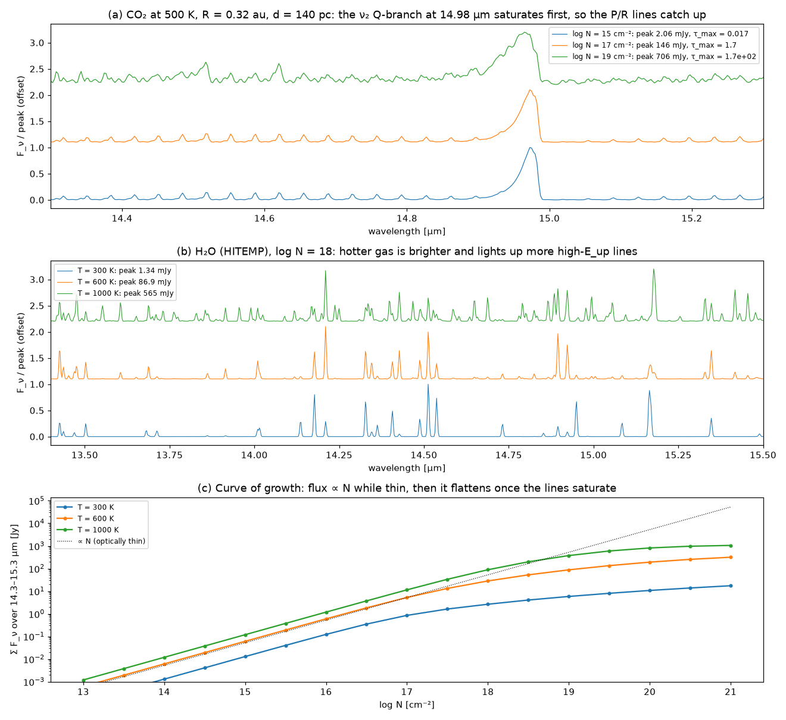</p>

### 4. From intensity to flux: the instrument

A component with emitting radius $R$ at distance $d$ subtends $\Omega = \pi R^2/d^2$. The emission is Doppler
shifted by the component's velocity $v_r$ (default 0 after the rest-frame correction) and seen through
MIRI-MRS. The flux in pixel $i$ is

$$
F_i = \Omega \sum_j K_{ij}\, I_\nu(x_j - v_r/c),
$$

where the sparse **instrument operator** $K$ convolves with a Gaussian line-spread function of FWHM
$\lambda/\mathcal{R}(\lambda)$ **and** integrates over the pixel $[x_i^-, x_i^+]$:

$$
K_{ij} = \frac{\delta x}{x_i^+ - x_i^-}\;\frac{1}{2}\left[\operatorname{erf}\!\left(\frac{x_i^+ - x_j}{\sqrt 2\,\sigma_i}\right) - \operatorname{erf}\!\left(\frac{x_i^- - x_j}{\sqrt 2\,\sigma_i}\right)\right],\qquad \sigma_i = \frac{1}{2\sqrt{2\ln 2}\,\mathcal{R}(\lambda_i)} .
$$

Each row sums to 1, so flux is conserved (a unit test checks this to 10⁻³). The resolving power is the
empirical in-flight relation of Argyriou et al. (2023),

$$
\mathcal{R}(\lambda) = 4603 - 128\,\lambda[\mu\mathrm{m}] \qquad (\text{about } 4000 \text{ at } 5\,\mu\text{m and } 1100 \text{ at } 27\,\mu\text{m}),
$$

with optional alternatives: piecewise-linear values per sub-band after Jones et al. (2023)
(`R_model: jones2023`), a global scale factor (`R_scale`), or a constant (`R_constant: 3000`). Every sub-band keeps its own
pixels and its own $K$: overlapping sub-bands are **not** stitched for fitting.

### 5. Many molecules at once

The total model is the sum over emitting **units**:

$$
F_i^{\text{model}} = \sum_{u} \Omega_u \sum_j K_{ij}\, B_\nu(T_u)\left[1 - e^{-\tau_u(x_j)}\right].
$$

By default each component is its own unit. The slabs are side by side (different radii), not on top of
each other, so one molecule does not absorb another's emission. Three constructions change that:

| Construction | Config | Physics |
| --- | --- | --- |
| **Opacity group** | same `group:` name on several components | co-spatial gas. The members share $T$, $\Omega$, $v_r$ and $\Delta v$, and their optical depths add, $\tau_u = \sum_{c\in u}\tau_c$, *before* the exponential, so overlapping bands of different molecules shadow each other |
| **Isotopologue tie** | `tie_to: CO2, ratio: 70` | $^{13}$CO₂ shares $T$, $R$, $v_r$ and $\Delta v$ with CO₂ and has $N_{13} = N_{12}/\text{ratio}$ (in the linear area solve its flux joins the parent's column, so both keep one area). The ratio can be free (bounds 10–300) or fixed. Because $^{13}$CO₂ is optically thin where CO₂ saturates, it breaks the $N$–$R$ degeneracy of the parent |
| **Radial gradient** | `kind: annuli` | a power-law disk instead of one slab: $T(r) = T_0 (r/R_\text{in})^{-q}$, $N(r) = N_0 (r/R_\text{in})^{-p}$ over `n_annuli` log-spaced annuli between $R_\text{in}$ and $R$. Each annulus $k$ contributes $w_k B_\nu(T_k)(1-e^{-\tau_k})$ with $w_k = (r_{k+1}^2 - r_k^2)/R^2$. Free parameters: $\log N_0$, $T_0$, $q$, $p$, $\log R_\text{in}$, $\log R$. Here $R$ is the outer radius, which is not a linear scale, so it is fitted like the other parameters rather than by NNLS, and $\tau_\text{max}$ is not reported (Romero-Mirza et al. 2024 and Temmink et al. 2025 use similar models) |

Water usually needs two or three temperature components (hot, warm and cold: e.g. Banzatti et al. 2023,
2025). Each component can use its own line list: HITEMP for hot water (complete at high $E_u$), HITRAN
for cold water (accurate low-$E_u$ lines at 17–27 µm). See `examples/configs/FZ_Tau_water_hot_cold.yaml`.

### 6. Absorption screens (gas seen against the continuum)

Embedded protostars and edge-on disks show the same bands in *absorption*: cold foreground gas against
the warm continuum (Lahuis & van Dishoeck 2000; Li, Boogert & Tielens 2024). A component with
`kind: absorption` is such a screen. Its optical depth $\tau_a(x)$ is computed exactly as for an emitting
slab from $(\log N, T, \Delta v)$, the whole screen is shifted by its velocity $v$ (negative = blueshifted,
e.g. an outflow), and instead of an emitting area it has a **covering fraction** $f_c$ of the continuum
source:

$$
F_\nu = F_c\,\bigl[1 - f_c\,(1 - e^{-\tau_a})\bigr]
\qquad\Longrightarrow\qquad
F^{\text{model}}_i - F_{c,i} = \sum_j K_{ij}\,F_c(x_j)\,\bigl[\mathrm{Tr}_a(x_j) - 1\bigr],
\quad \mathrm{Tr}_a = 1 - f_c(1 - e^{-\tau_a}).
$$

This is the `spec_abs` model of the group's `slabby.py`, on the same fine grid, LSF and line lists as the
emission (the continuum $F_c$ is the one from the data-preparation step, interpolated onto the fine grid).
Things to know:

- **Free parameters**: $\log N$, $T$, $v$ and $f_c$ (the velocity is always free for a screen; `fwhm` with
  `fit_fwhm`). There is no area: the depth of a saturated line is set by $f_c$, its wings by $N$ and $\Delta v$,
  and the line ratios by $T$. Default bounds are wider than for emission: $T$ 20–1500 K, $v$ ±200 km/s.
- **Several screens** multiply their transmissions. The per-unit curves are attributed sequentially (the
  second screen acts on what the first let through) so that they still add up to the total.
- **`covers: continuum`** (default) puts the screen in front of the continuum only; the emission
  components are side by side with it. **`covers: all`** puts it in front of everything: the emitting
  slabs are attenuated by the same $\mathrm{Tr}_a$ before the LSF (the `two_slabs_spec` geometry of the
  group's code, where the flux is $(F_c + F_\text{em})\,e^{-\tau}$). The model stays linear in the emitting
  areas either way, so the NNLS area solve, the grid and the optimiser work unchanged.
- **Thermal width**: `fwhm_thermal: true` adds the thermal FWHM at $T$, $2\sqrt{2\ln 2}\sqrt{kT/m}$, in
  quadrature to `fwhm` (0.5 km/s for H₂O at 100 K, so in practice the turbulent `fwhm` dominates). The
  old code used $\sqrt{2kT/m}$ *as* the FWHM, i.e. a 1.7× narrower profile; the equivalent widths agree.
- **The continuum matters**: for an absorption-dominated spectrum the default lower-envelope continuum
  follows the troughs and hides them. Either load the continuum with the spectrum (a `continuum` or
  `baseline` column in a CSV, kept with `continuum.method: given`) or use `irsqr` with `quantile: 0.9`
  (an upper envelope).
- `jalebi model --kind absorption --fc 0.6 --rv -30` writes an absorbed flat continuum and the
  transmission; `examples/11_absorption_fit.py` fits a synthetic CO₂ screen in front of hot CO₂ emission
  and recovers $(\log N, T, v, f_c)$ within 1σ. Full description and validation: [`docs/ABSORPTION.md`](docs/ABSORPTION.md).

### 7. Derived quantities

For every untied emitting component JALEBI reports the emitting radius $R$ (au), the area-weighted column

$$
\log_{10}(N\!\cdot\!A) = \log_{10} N + \log_{10}\pi + 2\log_{10}R \qquad [\mathrm{cm^{-2}\,au^2}],
$$

the total number of molecules $\mathcal{N} = N\,\pi R^2$ (`logNmol`, with $R$ in cm), and the peak optical
depth $\tau_\text{max}$.

---

## Degeneracies: what a slab fit can and cannot tell you

These are the reason JALEBI samples the posterior rather than quoting a best fit.

**Optically thin: $N$ and $R$ are degenerate.** When $\tau \ll 1$ every line flux is $\propto N R^2\, g_u e^{-E_u/T}/Q(T)$
(Eq. 3). Only $T$ (from the line ratios) and the product $N\cdot A$ are constrained: the posterior is a
ridge of slope $-2$ in $(\log R, \log N)$. JALEBI reports `logNA` and the fraction of posterior samples
with $\tau_\text{max} < 1$ (`tau_flags.json`, `*_thin_frac` in batch tables). `fit.area_param: logNA`
makes $\log N\!\cdot\!A$ the sampled parameter, so a uniform prior applies to it rather than to $\log R$. It
does not speed up the sampling: emcee's stretch move is affine-invariant, so a straight ridge is no harder
than an axis-aligned one. What makes the chains slow is where the ridge bends at $\tau \sim 1$ and meets
the bounds, so give such components longer chains.

**Optically thick: $N$ is only a lower limit.** When the lines saturate, the flux measures $B_\nu(T)$ and the
area, and $N$ enters only through $\sqrt{\ln\tau_0}$: $R$ and $T$ are well constrained, $N$ poorly, and $N$ is
degenerate with the intrinsic line width $\Delta v$. The *range* of optical depths among the lines is what
pins $N$ down: weak lines stay thin while strong ones saturate. So do optically thin isotopologues
(¹³CO₂ against CO₂, H¹³CN against HCN, ¹³CCH₂ against C₂H₂).

**Temperature against column.** A hotter thin slab and a cooler thicker one can produce similar line
ratios: the classic $T$–$N$ banana in the corner plots.

**Between components.** Two water components can swap labels. `fit.ordering: [[H2O_hot, H2O_warm]]`
imposes $T_\text{hot} > T_\text{warm}$ and removes the mirror mode. Overlapping bands (water lines under
the CO₂ and HCN Q-branches, the C₂H₂/HCN pseudo-continuum) correlate molecules with each other. The
correlation-matrix figure shows these cross-molecule terms.

**The continuum.** A continuum placed too high removes the blended-line pseudo-continuum along with the
dust, and biases the columns and temperatures of blended bands. On the bundled synthetic spectrum the
choice of continuum method alone moves the C₂H₂ temperature by about 100 K
(`examples/03_continuum_methods.py` compares every method against the known continuum). The statistical
error bars do not include this systematic error. Refit with two continuum settings before you trust a
C₂H₂ or HCN temperature.

**Physical priors help.** Organics come from within ~1 au, so `bounds: {logR: [-2, 0]}` keeps an optically
thin molecule from running off to a huge, tenuous slab.

---

## Data preparation

`jalebi prep config.yaml` (or `jalebi.pipeline.prepare`) turns the raw spectrum into what is fitted:

```mermaid
flowchart LR
  A["x1d / s3d / CSV"] --> B["rest frame"]
  B --> C["spike filter"]
  C --> D["continuum per sub-band"]
  D --> E["masks: H I, H2, fine-structure, OH prompt"]
  E --> F["noise: MAD per sub-band"]
  F --> G["continuum-subtracted spectrum"]
  G --> H["detect"] --> I["grid"] --> J["differential evolution"] --> K["emcee"] --> L["results/"]
```

**Input.** A folder of pipeline `Level3_ch*-*_x1d.fits` files: the 12 sub-bands are read with their
`CHANNEL`/`BAND` headers, and pixels beyond the nominal band edges (±0.02 µm) are masked. The input can
also be a folder of `_s3d.fits` cubes with `target.extraction.source: s3d`, a single FITS file, or a CSV
with `wave, flux, err[, band]` columns. Any path can be written `example:<name>` to use the bundled data
(`example:FZ_Tau`, `example:synthetic/synthetic_miri_ch3.csv`).

**Cube extraction** (`s3d`). JALEBI does circular-aperture photometry at a sky position (RA/Dec,
degrees or sexagesimal) in every sub-band, with radius $k \times \mathrm{FWHM}(\lambda)$,
$\mathrm{FWHM} = 0.033\,\lambda + 0.106''$ (Law et al. 2023). It uses fractional pixel weights, an
optional background annulus (median), and an aperture correction (`mrs`: an empirical encircled-energy
curve calibrated on FZ Tau against the pipeline x1d, ~1 %; `gaussian`; `x1d`: rescale each band to the
pipeline level; `none`). `jalebi.data.cube_positions(folder)` gives the header position and the
brightest pixel. For FZ Tau the header coordinates are 0.5″ off the source, which would lose ~30 % of
the flux at 1.5 FWHM.

**Spikes.** A pixel is flagged when it deviates from a 9-pixel running median by more than 8× the MAD
scatter of its sub-band while both neighbours deviate by less than 30 % of that. Real lines (FWHM ≥ 1.8 pixels) keep
their neighbours above ~40 % of the peak, so they are never flagged.

**Continuum** (`continuum.method`, estimated per sub-band):

| Method | Algorithm | Main knobs |
| --- | --- | --- |
| `irsqr` (default) | iteratively reweighted spline quantile regression (pybaselines; MINDS style) | `quantile` (0.1), `knot_spacing` in pixels (25) |
| `median_sg` | iterative running percentile with emission clipping, then median + Savitzky–Golay (JDISCS style) | `median_window` (101), `median_percentile` (25), `sg_window` (51) |
| `asls` | asymmetric least squares | `lam` (10³), `p` (0.01) |
| `convex_hull` | lower convex hull in overlapping segments, smoothed | `segment` (300), `overlap` (100) |
| `rolling_min` | rolling percentile envelope, smoothed | `percentile` (5), `min_window` (61) |
| `spline` | PCHIP through anchor wavelengths you choose (click them in the web app) | `anchors`, `anchor_width` |
| `banzatti` | spline through the medians of the line-free windows of Banzatti et al. (2025) | — |
| `none` | the input is already continuum-subtracted | — |

**Protected ranges.** The C₂H₂ (13.66–13.75 µm), HCN (13.98–14.06), CO₂ (14.93–15.02), ¹³CO₂
(15.40–15.44), C₆H₆, CH₄ and C₄H₂ Q-branches are removed before the baseline is estimated and bridged
by a clamped PCHIP interpolant, so the baseline does not dip into them. **Model-aware refinement**
(`refine_iterations: 1`) subtracts the best-fit gas model and re-estimates the continuum through the *centre*
of the residual. The new continuum is kept only if it lowers the χ² of the current best fit; the
optimiser then runs again on it.

**Masks.** By default the fit ignores H I recombination lines, H₂ S(0)–S(5), [Ne II], [Ne III], [Ar II],
[Fe II], [S I] and [S III]: none of these is molecular LTE emission. It also ignores the
**high-excitation OH lines at 9–13 µm**: these are prompt emission from water photodissociation
(Tabone et al. 2021), located from the OH line list ($E_u \ge 12\,000$ K). Add your own masks with
`masks.extra`.

**Noise.** For each sub-band, $\sigma = 1.4826\,\mathrm{MAD}$ of the residual from a 25-pixel running median,
measured on line-free pixels once a continuum exists. This captures the real pixel-to-pixel scatter,
which is often larger than the pipeline errors. `fit.use_pipeline_err: true` uses the pipeline errors
instead; `fit.fit_noise_scale: true` fits a global factor $s$.

---

## Fitting and uncertainties

### Likelihood and priors

With data $d_i$ (continuum-subtracted), model $m_i(\theta)$, noise $\sigma_i$, optional per-window weights
$w_i$ and noise scale $s$:

$$
\ln\mathcal{L}(\theta) = -\frac12 \sum_i w_i \left[ \frac{(d_i - m_i(\theta))^2}{s^2\sigma_i^2} + \ln\!\left(2\pi s^2 \sigma_i^2\right) \right].
$$

The priors are uniform within bounds, with optional Gaussians (`rv` gets $\mathcal{N}(0, 5\ \mathrm{km\,s^{-1}})$ when
fitted) and ordering constraints ($T_a > T_b$, otherwise $\ln p = -\infty$). The default bounds are
$\log N \in [13, 21]$, $T \in [100, 1500]$ K, $\log R \in [-2.5, 1.5]$, $\log N\!A \in [12, 22]$,
$v_r \in [-30, 30]$ km s⁻¹, $\Delta v \in [2, 30]$ km s⁻¹, ratio $\in [10, 300]$, $q \in [0, 1.5]$,
$p \in [-1, 3]$, $\log R_\text{in} \in [-2.5, 0.5]$ and $\log s \in [-1, 1]$. Override any of them per
component (`bounds: {T: [300, 1200]}`), or hold parameters fixed (`fixed: [ratio]`).

### The areas are linear, so they are solved exactly

At fixed $(N, T)$ the model is linear in the areas: $m_i = \sum_u a_u f_{iu}$ with $a_u = R_u^2 \ge 0$, where $f_{iu}$ is
unit $u$'s flux for $R = 1$ au (with any tied isotopologue's flux added in, since it shares the area). Annuli
components are the exception: they keep their outer radius as an ordinary parameter. For the grid and the global optimiser, JALEBI therefore solves the
areas by **non-negative least squares** (Lawson & Hanson 1974) at every step. This profiles out one
parameter per component, and it makes the optimiser's search space smaller and better conditioned. The
MCMC samples the areas like any other parameter, so their uncertainties and correlations are in the
posterior.

### The three stages

| Stage | What it does | Why |
| --- | --- | --- |
| **grid** | χ² over (log N, T) for one component at a time (config order or `grid.order`), with the others held at their current values and the component's area from a 1-D NNLS. Maps show Δχ² contours (2.30, 6.17, 11.8 = 1, 2, 3σ for two parameters), the τ = 1 contour and an edge flag | the familiar MINDS-style view, and a good starting point |
| **optimise** | `scipy` differential evolution (Storn & Price 1997) over all non-area parameters jointly, areas by NNLS, parallel population evaluation; then a Nelder–Mead polish of the full posterior | finds the global mode when bands overlap and components interact |
| **mcmc** | `emcee` affine-invariant ensemble sampler (Goodman & Weare 2010; Foreman-Mackey et al. 2013). Walkers (default max(4·ndim, 32)) start in a ball of 1 % of each prior width around the optimum. The work is spread over a process pool, and chains are checkpointed to HDF5 | posterior uncertainties and degeneracies |

### Convergence diagnostics (reported for every run)

| Diagnostic | Criterion |
| --- | --- |
| integrated autocorrelation time τ (per parameter) | chain length ≥ 50 τ |
| burn-in | min(2 max τ, half the chain) |
| split-R̂ (Gelman & Rubin 1992; Gelman et al. 2013), walkers as chains, after burn-in | < 1.05 |
| acceptance fraction | 0.15–0.6 |
| effective samples $n_\text{eff} = (n_\text{steps} - n_\text{burn})\,n_\text{walkers}/\tau$ | reported |
| `at_edge` | 16th or 84th percentile within 2 % of a bound: the prior, not the data, is limiting |

The summary (`summary.csv`) gives the median and 16/84 % of every free parameter and of `logNA`,
`logNmol` and `R_au`. The figures are `corner.png`, `correlation.png` (every parameter against every
other, across molecules), `traces.png` and `posterior_predictive.png` (the 16–84 % band of 100 posterior
draws over the data).

### Is a component needed? The ΔBIC test

After the fit, each unit is removed in turn ($\log N \to -30$) and

$$
\Delta\mathrm{BIC} = \Delta\chi^2 - k \ln n
$$

is computed ($k$ = the unit's free parameters, $n$ = pixels). ΔBIC > 10 is strong evidence that the data
need the component (`detections.csv`).

---

## Which molecules? Automatic detection

`jalebi detect config.yaml`, `jalebi fit --auto-detect`, `fit.auto_detect: true`, or the web app's *Detect
molecules* tab decide from the data which components to fit:

1. **Candidates**: every molecule with a line list (bundled or cached) and a characteristic window
   (`DEFAULT_WINDOWS` in `molecules.py`), except OH and H₂ (not LTE slabs).
   Each gets LTE templates at fixed moderate columns and a few temperatures (300 and 600 K; CO 700 and
   1500 K), restricted to its characteristic windows.
2. **Water** is always included, as separate hot (850 K), warm (400 K) and cold (170 K) candidates. Each is
   a thin-plus-thick template pair so the NNLS can mimic the real saturation pattern. The cold candidate
   is judged at 17.5–27.5 µm.
3. **One NNLS solve** fits the emitting areas of all templates at once.
4. **Significance**: for each candidate its templates are removed, the other areas re-solved, and
   Δχ² is measured *inside the candidate's own windows*. It is scaled by the local χ²_red of the full
   solution (floored at 1), so continuum errors on real spectra do not flag everything:
   ΔBIC = Δχ² − 3 ln n_local; detected if ΔBIC > `threshold` (10).
5. **Isotopologues** count only when their parent is detected, and are suggested as tied components.
   Starting values come from the best template, and the suggested windows are the union of the detected
   molecules' windows. A hot > warm > cold ordering prior is added.
6. **Absorption** (`fit.detect.mode: both`, the default; `emission` / `absorption` restrict it): every
   candidate also gets a *screen* template — `kind: absorption` at a fixed (log N, T), covering fraction
   as the linear coefficient, bounded 0–1 (BVLS) — judged as `<mol>_abs` with a 4-parameter BIC penalty
   and **only on pixels below the continuum**: a screen must explain real troughs, not the mismatch of
   the emission templates between emission lines. One screen per candidate enters the solve (the model
   is linear in f_c for one screen; two of the same molecule would double-count saturated lines); its
   temperature is then chosen among a few (50–500 K) by refitting each alone to the residual. An
   emitting slab and a screen of the same molecule are nearly anti-collinear, so `both` runs three
   passes: emission alone; everything together with only the screens judged; and, when screens are found,
   all emission candidates together with the detected screens for the final verdict on the emission (a
   band hidden under absorption is only found there — the CO₂ emission behind the screen in the example
   below). Detected screens become `kind: absorption` components with `fc` from the solve (v = 0 to
   start: the fit finds the shift). The continuum must be the unabsorbed one (see § The physics 6): with
   the default lower-envelope continuum absorption is invisible.

On the bundled FZ Tau spectrum this finds CO, hot, warm and cold water, CO₂ and C₂H₂, with HCN just below
the threshold (examples/04) — and no absorber (the emission results are identical to `mode: emission`). On
the bundled synthetic absorber (`example:synthetic/absorption_synthetic.csv`) it finds the CO₂ screen
(150 K, f_c 0.64 for a truth of 120 K, 0.6; ΔBIC +356) and the hot CO₂ emission behind it (ΔBIC +102),
nothing else.

---

## Line maps and velocity maps from IFU cubes

Most Class II disks are unresolved in the continuum, so the maps that matter show **extended line
emission** — jets, winds, H₂, [Ne II], [Fe II], CO — after the point source is removed. `jalebi.cube`
makes them from JWST `s3d` cubes, and a region drawn on any map becomes a spectrum for the normal slab fit.
Full description, pitfalls and validation: [`docs/CUBE.md`](docs/CUBE.md).

```bash
jalebi cube demo                                          # the bundled HV Tau C cutouts, ~30 s
jalebi cube info  /path/to/target                         # cubes, bands, source, lines covered
jalebi cube maps  /path/to/target -l "[Fe II] 5.34" -l "H2 S(1)" --zero-point star --distance 140
jalebi cube stack /path/to/target -l "H2 S(1)" -l "H2 S(2)" -l "H2 S(3)" --name H2
jalebi cube pv    /path/to/target -l "[Fe II] 5.34" --pa 25 --length 5
jalebi cube region /path/to/target --circle "0.42 0.91 0.35" --offsets --out jet_north.csv --fit config.yaml
jalebi cube ratio /path/to/target -l "[Fe II] 5.34" -l "[Ne II] 12.81" --rms-region "12 8 3" --sigma 5,5 --recipe cube_maps
jalebi cube moment0 /path/to/target -l 5.3402=FeII --component full   # the old cube_maps.py make_moment0
jalebi cube init cube.yaml --example hv_tau_c && jalebi cube run cube.yaml     # everything from one YAML
jalebi serve --module cube --cube /path/to/target         # the web app's Cube maps module
```

```python
import jalebi
from jalebi import cube
cs = cube.CubeSet("example:HV_Tau_C_cube")                  # a folder of *_s3d.fits (all sub-bands)
lc = cube.prepare_line(cs, "[Fe II] 5.34")                  # slab, per-spaxel continuum, point-source removal
m  = cube.line_maps(lc, zero_point="star")                  # moments + Gaussian centroids with MC errors
m["vcen"], m["vcen_err"], m["mom0_ext"], m.summary          # 2-D arrays on the cube's spaxel grid
m.write("maps/", distance_pc=140, pa_deg=25)                # FITS (celestial WCS) + PNG + CSV + JSON
st = cube.line_maps(cube.stack_lines(cs, ["H2 S(1)", "H2 S(2)", "H2 S(3)"]))
spec = cube.region_spectrum(cs, cube.offset_region("circle", lc.center_radec, 0.42, 0.91, 0.35))
run = jalebi.run_pipeline(cfg, spec=spec)                   # the LTE slab fit of that region
```

1. **Per-spaxel local continuum**: a low-order polynomial over the line-free channels either side of the
   line, every spaxel at once, with sigma clipping.
2. **Point-source removal**: the continuum image next to the line is the PSF at that wavelength; scaled in
   the PSF core and subtracted plane by plane, it follows the PSF's change across a sub-band. Companions
   (HV Tau AB next to HV Tau C) are removed too; what is left is the extended emission.
3. **Moments 0/1/2** with S/N masks, and a **Gaussian centroid per spaxel with Monte Carlo errors** for
   the velocity maps. The MRS resolves 85–200 km/s, so velocities come from centroid shifts (a few km/s at
   S/N ≳ 20), not from line widths. **Stacking** several lines of one species (H₂ S(1)–S(3)) raises the S/N.
4. **Channel maps** and **position–velocity cuts** along any PA (jet axis).
5. **Region spectra**: circle, ellipse, annulus or polygon (DS9 regions in and out) → spectrum over all
   sub-bands → the slab fit, so region-by-region LTE fits come for free.

6. **Line-ratio maps** (line 2 reprojected onto line 1, masked at σ × noise) and masks from an empty-sky
   circle or a Background2D background.

**Coming from `cube_maps.py`?** `from jalebi.cube.cube_maps import make_moment0, make_ratio_plot,
plot_moment0_map, add_au_box, ...` keeps the old functions, arguments and file names, and reproduces
the old maps (aspls continuum over ±0.1 µm, 9 / 5 / 2+2-channel windows) to float32 precision; the same
recipe is `--recipe cube_maps` in the terminal, one button in the web app, and `--example cube_maps` as a
config. The old files hold ∫I_ν dλ in MJy sr⁻¹ **m** (10⁻⁶ × MJy sr⁻¹ µm),
so their ratios are line-flux ratios × (λ₁/λ₂)²; see [`docs/CUBE.md` §6](docs/CUBE.md#6-coming-from-cube_mapspy).

Handled pitfalls: cube-building resampling artefacts at the spaxel scale (per-spaxel continuum and an
empirical noise floor), sub-band-to-sub-band wavelength offsets of a few km/s (`band_offsets_kms`,
`zero_point: star`, stacks aligned on the source), and a PSF that changes across one sub-band (the
template is the continuum at each plane's wavelength). The maps open in CARTA and DS9.

<p align="center">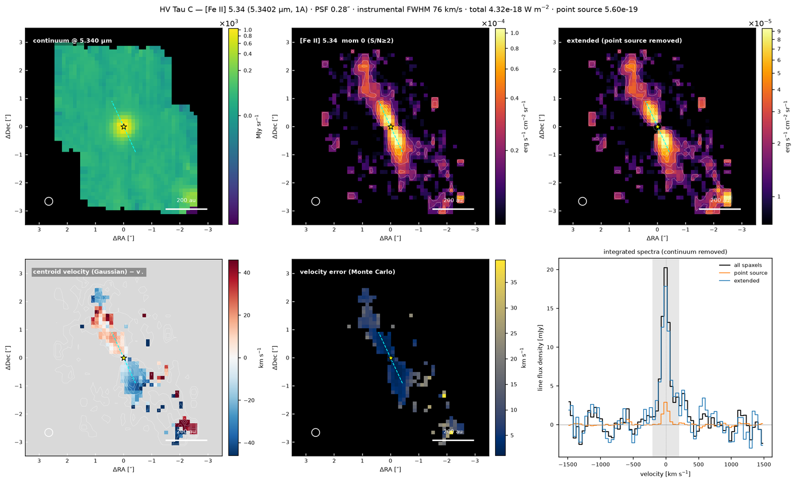</p>
<p align="center"><em>HV Tau C (MINDS, JWST PID 1282), [Fe II] 5.34 µm from the bundled cutouts: continuum, line, extended
emission after point-source removal, centroid velocity relative to the source (north lobe redshifted, south lobe
blueshifted) with its Monte Carlo error, and the integrated spectra. The dashed line is the jet axis (PA 25°).</em></p>

<p align="center">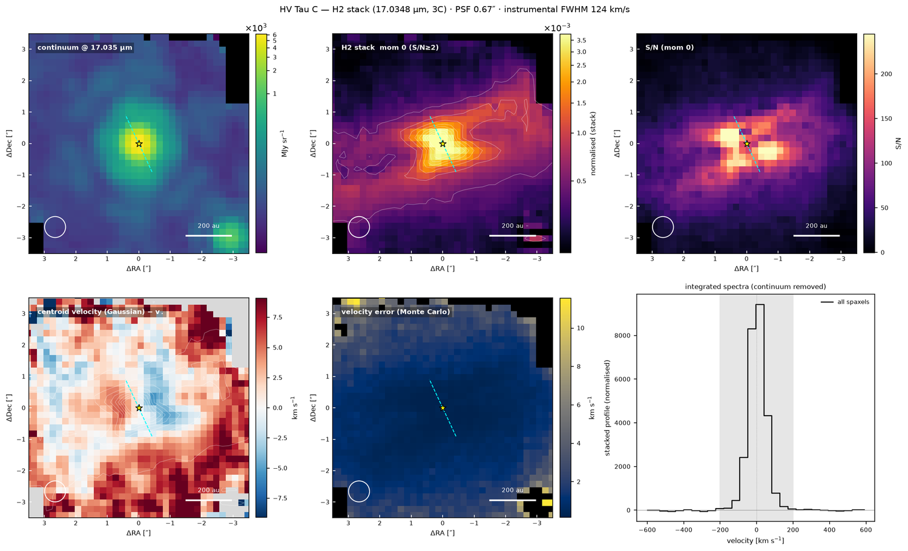</p>
<p align="center"><em>The H₂ S(1)+S(2)+S(3) stack of HV Tau C: emission elongated along PA ≈ 105°, and a velocity gradient
along the jet axis close to the source.</em></p>

---

## Rotation diagrams

<p align="center"></p>

`jalebi.rotdiag` turns a spectrum (or a table of line fluxes) into a rotation diagram and fits it. Pick a molecule;
the module loads its line list, finds the lines inside the spectrum, measures them and fits
ln(N_u/g_u) vs E_u. Everything — physics, options, validation — is in [`docs/ROTDIAG.md`](docs/ROTDIAG.md).

```bash
jalebi rotdiag demo                                   # bundled synthetic H2: two temperatures, A_V 10, OPR 2.3
jalebi rotdiag lines H2 example:FZ_Tau                # the lines (blends, contaminants) that would be used
jalebi rotdiag fit example:FZ_Tau -m H2 --model two --opr species --av-free --mcmc --compare
jalebi rotdiag fit example:FZ_Tau -m CO --opacity --fwhm 4.7 --geometry radius --radius 0.3
jalebi rotdiag fit --fluxes h2.csv --flux-unit "1e-17 erg s-1 cm-2" -m H2 --model two --av-free
jalebi serve --module rotdiag                         # the Rotation diagram module of the web app
```

- **Molecules**: H₂ (the full Roueff et al. 2019 line list is now bundled, S(0) included, with exact ortho and para
  partition sums), CO (HITEMP), ¹³CO, OH, H₂O (the isolated lines of Banzatti et al. 2025 by default), and any other
  molecule with a line list.
- **Lines**: inside the spectrum, ranked by their thin LTE intensity; lines closer than half a resolution element
  are one feature (flux = the sum of its members); neighbours, other-band blends (CO v = 2–1 next to 1–0) and known
  lines of other species are fitted simultaneously.
- **Fluxes**: pixel-integrated Gaussians of the MRS resolution at one line velocity, with a polynomial baseline, by
  linear least squares (exact errors); velocity and width scale (per MRS channel) from the profile likelihood; or
  integration over windows.
- **Models**: one temperature, two (warm + hot), or a power law dN ∝ T^−b dT (Neufeld & Yuan 2008); the
  ortho-to-para ratio thermal, free with each spin species in LTE (exact at any T), or the ln(OPR/3) offset (JOYS);
  A_V with the Gordon et al. (2023) curve by default, four others bundled, or yours (e.g. KP5) as a CSV; optical
  depth by the curve of growth of a Gaussian slab; normalised to the number of molecules (unresolved disks), an
  emitting radius, an aperture (column density) or intensity.
- **Fit**: χ² in flux space with a 10 % flux systematic, least squares with many starts, then emcee; corner plots,
  BIC comparison of the three models, derived column, number of molecules, warm-gas mass, A_K, LTE OPR, τ_max,
  line luminosity.
- **Figures** in paper style (log₁₀ and ln axes, observed and de-reddened points, components, parameter box), with the
  power law fitted and drawn next to the two-component model (`fit: {also: [powerlaw]}`, default for H₂ in the app).
- **Validated** on synthetic spectra (all parameters within 1.6σ), on full LTE slab spectra of jalebi's spectral
  model (thin H₂; optically thick CO, which a thin fit overestimates by 600 K), and against pdrtpy.

---

## Configuration reference

One YAML file drives the CLI, the Python API and the web app, which exports and imports it. Every key
is optional except the components you want to fit. The block below is a complete example (FZ Tau). Where
the code default differs from the example value, the comment says so.

```yaml
target:
  name: FZ Tau                  # default "target"
  path: example:FZ_Tau          # folder of x1d (or s3d) files, a FITS file, a CSV, or example:<name>
  distance_pc: 130              # default 140
  rv_kms: 20                    # heliocentric radial velocity removed before fitting (default 0)
  spike_filter: true
  extraction:                   # only for source: s3d
    source: x1d                 # x1d | s3d
    ra: null                    # aperture centre (deg or "04:32:31.76") — required for s3d
    dec: null
    aperture_fwhm_scale: 1.5    # radius = scale × FWHM(λ)
    aperture_arcsec: null       # or a fixed radius
    annulus_arcsec: null        # [r_in, r_out] background annulus
    apcorr: mrs                 # mrs | gaussian | none | x1d
continuum:
  method: irsqr                 # irsqr | median_sg | asls | convex_hull | rolling_min | spline | banzatti | none
                                # | given (keep the continuum loaded with the spectrum: CSV 'continuum'/'baseline' column)
  quantile: 0.1                 # irsqr (0.9 = upper envelope, for absorption-dominated spectra)
  knot_spacing: 25              # irsqr, pixels
  median_window: 101            # median_sg
  median_percentile: 25.0
  sg_window: 51
  sg_order: 2
  n_iter: 5
  lam: 1000.0                   # asls
  p: 0.01
  segment: 300                  # convex_hull
  overlap: 100
  percentile: 5.0               # rolling_min
  min_window: 61
  anchors: []                   # spline: anchor wavelengths (µm)
  anchor_width: 3
  smooth: 0                     # extra Savitzky–Golay smoothing (pixels)
  protect: true                 # bridge the Q-branches (protected: {name: [lo, hi]})
  refine_iterations: 0          # model-aware continuum refinement passes
masks:
  default_lines: true           # H I, H2, fine-structure lines
  oh_prompt: true               # high-E_up OH lines at 9–13 µm
  oh_whole_range: false         # mask all of 9–13 µm instead
  extra: {}                     # {"my line": [lo, hi]}
linedata:
  releases: {H2O: hitemp}       # line-list release per molecule; default {} = HITRAN for every molecule
  data_dir: null                # user cache folder; overrides $JALEBI_DATA (default ~/.jalebi/linedata)
components:
  - name: H2O_hot               # unique name
    molecule: H2O               # see `jalebi linedata list`
    logN: 18.0                  # starting values (log10 cm^-2, K, log10 au); defaults 17, 500, -0.5
    T: 800
    logR: -0.6
    rv: 0.0                     # km/s (free with fit.fit_rv)
    fwhm: 4.7                   # intrinsic line FWHM, km/s (free with fit.fit_fwhm)
    kind: slab                  # slab | annuli | absorption (a screen: F = F_c [1 - fc (1 - e^-tau)])
    fc: 1.0                     # absorption: covering fraction of the continuum (free, 0-1)
    covers: continuum           # absorption: continuum | all (also absorbs the emission components)
    fwhm_thermal: false         # add the thermal width at T in quadrature to fwhm
    group: null                 # components with the same group share T and area and add opacity
    tie_to: null                # parent component (isotopologues)
    ratio: null                 # parent/child column ratio for tie_to (default per molecule, e.g. 70)
    q: 0.5                      # annuli: T(r) power-law index
    p: 1.0                      # annuli: N(r) power-law index
    logRin: -1.5                # annuli: inner radius
    n_annuli: 20
    linelist_release: null      # hitran | hitemp | ... (null = linedata.releases, else hitran)
    linelist_path: null         # a specific file (.par, .parquet, .csv)
    eup_max: null               # drop lines above this E_up (K)
    enabled: true
    bounds: {}                  # {logN: [14, 19], T: [300, 1200], logR: [-2, 0]}
    fixed: []                   # parameter names held fixed, e.g. [ratio]
fit:
  windows: [[13.45, 17.5]]      # µm; default [] = the default windows of the listed molecules
  stages: [grid, optimise, mcmc]
  area_param: logR              # logR | logNA
  ordering: [[H2O_hot, H2O_warm]]   # T(first) > T(second); default []
  fit_rv: false
  fit_fwhm: false
  fit_noise_scale: false
  use_pipeline_err: false
  window_weights: {}            # {window index: weight}
  oversample: 6                 # fine-grid points per line FWHM
  auto_detect: false
  detect: {threshold: 10, candidates: [], replace_windows: true, keep_undetected: false, oversample: 2}
  grid: {logN: [14, 20, 25], T: [150, 1200, 22], order: [], n_jobs: 1}          # [lo, hi, n]
  optimise: {method: de, maxiter: 150, popsize: 12, workers: 1, polish: true, seed: 0}   # method de | nelder
  mcmc: {nwalkers: null, nsteps: 3000, processes: 1, seed: 0, ball: 0.01, thin_by: 1, checkpoint: true}
output: results/{target}        # default; {target} = source name -> results/FZ_Tau (a path without {target} is used as written)
R_model: argyriou2023           # argyriou2023 | jones2023
R_scale: 1.0
R_constant: null                # a constant resolving power instead of R_model
```

---

## Command-line reference

| Command | What it does |
| --- | --- |
| `jalebi` | banner and the commands to start with |
| `jalebi doctor [--quick] [--json]` | check packages, line lists, partition functions, example data, parallelism, speed |
| `jalebi demo [--no-mcmc] [--nsteps N] [--processes P]` | fit the bundled synthetic disk and compare with the truth |
| `jalebi examples DIR` | copy the example scripts, configs and notebook |
| `jalebi init FILE --example fz_tau\|synthetic\|water_hot_cold\|blank` | write a config to start from |
| `jalebi prep CONFIG [--target PATH] [--name NAME]` | ingest, rest frame, spikes, continuum, masks → `results/<source>/prep.csv`, `prep.png` |
| `jalebi detect CONFIG [--write OUT.yaml] [--threshold 10]` | automatic molecule detection |
| `jalebi fit CONFIG [--stages grid,optimise,mcmc] [--processes P] [--nsteps N] [--auto-detect] [--target PATH] [--name NAME] [--out DIR]` | run the fit; results in `results/<source>/` |
| `jalebi batch CONFIG TARGETS.csv [--workers W] [--auto-detect] [--only-failed]` | many disks in parallel → `population.csv` |
| `jalebi serve [--port 5006] [--data-root DIR] [--config FILE] [--show] [--module lte\|cube\|rotdiag] [--tab TAB] [--cube DIR] [--rotdiag-config FILE]` | the web app, opened on a module (and a tab of the LTE slab fit) |
| `jalebi cube info PATH` · `jalebi cube lines [PATH]` | cubes, bands, source position; the line catalogue (and what PATH covers) |
| `jalebi cube maps PATH -l LINE … [--zero-point star] [--no-psf] [--n-mc N] [--rv] [--distance] [--out DIR]` | moment, extended-emission and centroid-velocity maps (FITS + PNG) |
| `jalebi cube stack PATH -l LINE -l LINE … [--name H2]` | stack lines of one species in velocity space and map it |
| `jalebi cube channels PATH -l LINE [--vmin --vmax --dv]` · `jalebi cube pv PATH -l LINE --pa PA [--length --width]` | channel maps; position–velocity cut |
| `jalebi cube region PATH --circle/--ellipse/--annulus/--polygon "…" [--offsets] \| --ds9 FILE [--fit CONFIG]` | region spectrum over all sub-bands → CSV (→ slab fit) |
| `jalebi cube init FILE --example hv_tau_c\|synthetic\|blank` · `jalebi cube run FILE [-j N]` | cube config: everything in one YAML |
| `jalebi cube cutout PATH -l LINE … [--gzip]` · `jalebi cube synth DIR` · `jalebi cube demo` | small cubes around lines; synthetic cubes with known answers; the HV Tau C demo |
| `jalebi rotdiag molecules` · `jalebi rotdiag curves` · `jalebi rotdiag lines MOL [SPECTRUM]` | rotation-diagram molecules and line lists; extinction curves; the features a diagram would use |
| `jalebi rotdiag fit SPECTRUM -m MOL [--model single\|two\|powerlaw] [--opr thermal\|species\|offset] [--av-free] [--opacity --fwhm DV] [--geometry number\|radius\|aperture] [--mcmc] [--compare]` · `--fluxes CSV --flux-unit U` | find, measure and fit a rotation diagram (or fit a flux table) → `results/<source>/rotdiag/<MOL>/` |
| `jalebi rotdiag init FILE --example h2\|h2_fluxes\|co\|oh\|h2o` · `jalebi rotdiag run FILE` · `jalebi rotdiag demo` | rotation-diagram config; run it; the synthetic H₂ demo |
| `jalebi model --molecule H2O --logN 18 --T 600 --R 0.5 --wmin 13 --wmax 17` | a quick model spectrum to CSV |
| `jalebi synth OUT.csv [--snr 150] [--bands 3A,3B,3C] [--seed 0]` | a synthetic MRS spectrum with known parameters |
| `jalebi linedata list` / `fetch MOL… [--release hitran --wmin --wmax --force]` / `import MOL FILE --release TAG` | manage line lists |
| `jalebi about` · `jalebi --version` | where things are, how to cite |

`python -m jalebi …` works the same as `jalebi …`. The target table for `batch` needs the columns
`name,path,distance_pc,rv_kms`.

---

## The web app

`jalebi serve --show` opens a dark "observatory" interface (Panel + Bokeh). The switcher in the header opens one of
three **modules**, each with its own workflow: **LTE slab fit** (the six tabs below), **Cube maps** and **Rotation
diagram** (`jalebi serve --module cube|rotdiag` opens it directly; modules are built when first opened). A cube
region can be sent to the LTE slab fit or to the rotation diagram. Every setting maps onto a YAML config (the LTE
fit's in the sidebar, the cube's and the rotation diagram's in their own panels). New modules plug in through
`jalebi.modules.register_module`.

<p align="center">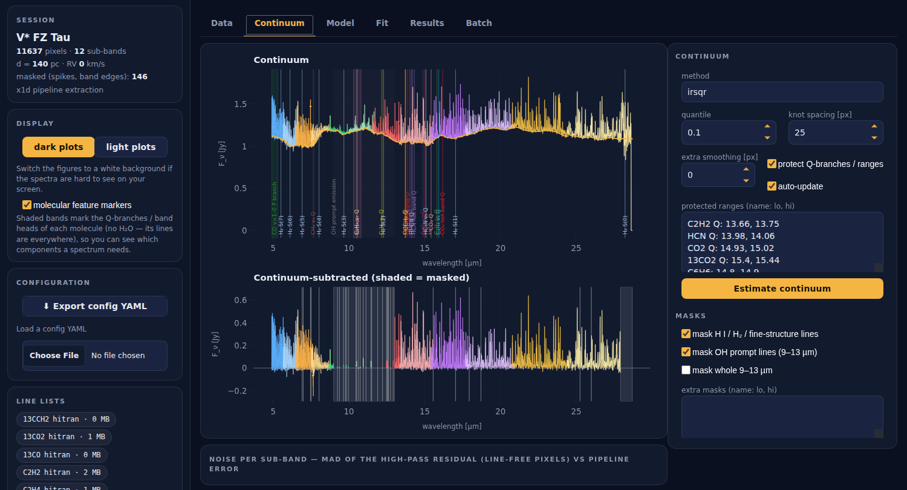</p>

| Tab | What you can do |
| --- | --- |
| **Data** | pick a target under the data root (default: the bundled examples) or upload a CSV/FITS; set distance, RV and spike filter; x1d or cube extraction with a clickable cube image; molecular feature markers |
| **Continuum** | try every method live, click spline anchors, edit protected ranges and masks |
| **Model** | one card per component with sliders for log N, T and log R, plus velocity, width, ties, groups and the line list. The model updates as you drag, and one slider re-evaluates only its own component. Sub-tabs: (log N, T) grid map, *Detect molecules* |
| **Fit** | run grid → optimiser → MCMC in the background with live progress; stop at any time |
| **Results** | best-fit and posterior tables, corner plot, correlation matrix, traces, posterior predictive, ΔBIC, τ flags |
| **Batch** | run a folder of targets with the current config |
| *module* **Cube maps** | open a folder of `s3d` cubes (default: the bundled HV Tau C), pick a line or an H₂ stack, *Make maps*; switch between continuum, moment 0, extended, velocity, velocity error, moments 1/2, S/N and single channels; click a spaxel for its spectrum and Gaussian fit; set a circle/ellipse/annulus or draw a polygon → *Extract region spectrum* → *Send to slab fit* (the target of the LTE slab fit) or *Send to rotation diagram*; PV cuts; write FITS + PNG; the equivalent `jalebi cube …` command and Python code, and the cube config YAML |
| *module* **Rotation diagram** | a spectrum (file, the LTE-fit target, a cube region) or a flux table; pick the molecule → ① find lines → ② measure → ③ fit → ④ MCMC; the spectrum with the lines marked and each line's fit, the line table (tick lines in or out), the diagram with model curves, residuals and upper limits, the posterior (corner, parameters, derived quantities, model comparison); settings for the selection, measurement, physics and MCMC; downloads and the equivalent command. See [`docs/ROTDIAG.md`](docs/ROTDIAG.md) §5 |

<p align="center">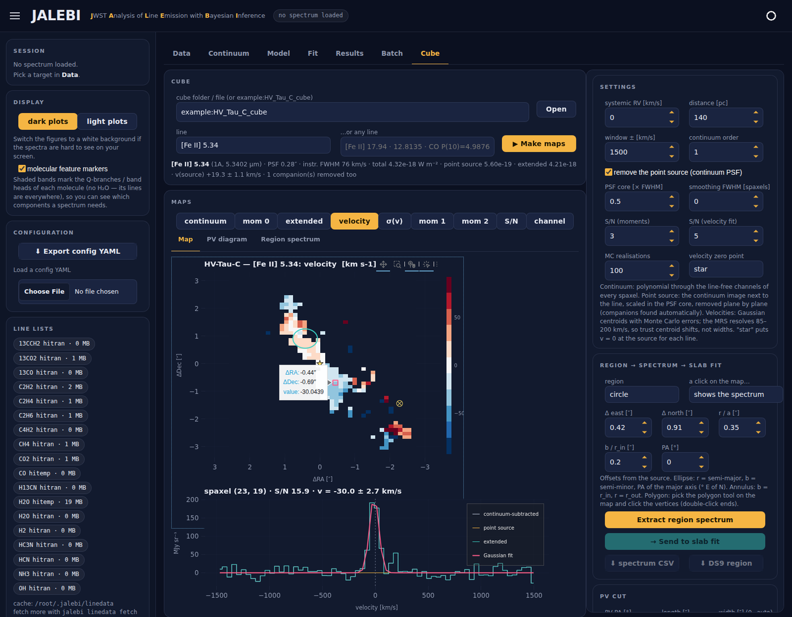</p>
<p align="center"><em>The Cube workspace on the bundled HV Tau C cubes: the [Fe II] 5.34 µm velocity map (relative to the source),
a clicked spaxel of the southern jet lobe with its Gaussian fit (−30 ± 3 km/s), and a circular region on the northern lobe
ready to be extracted and sent to the slab fit.</em></p>

Remote machines: `jalebi serve --address 0.0.0.0 --allow-websocket-origin host:5006`, or use an SSH tunnel
(`ssh -L 5006:localhost:5006 server`).

---

## Python API

```python
import numpy as np
from jalebi.model import Component, build_model
from jalebi.data import load_spectrum
from jalebi.config import ProjectConfig
from jalebi.pipeline import prepare, build_problem, RunResult, run_grid_stage, run_optimise_stage, run_mcmc_stage
from jalebi.detect import detect_molecules
from jalebi.synthetic import make_synthetic_spectrum
from jalebi import plots

# a model on any wavelength grid
wave = np.arange(14.5, 15.5, 0.0025)
m = build_model([Component("CO2", "CO2", logN=17.5, T=500, logR=-0.6)], wave, distance_pc=140)
flux = m.evaluate()                                   # Jy
flux2 = m.evaluate({"CO2": {"T": 700}})               # parameters overridden per call
tau = m.tau_flags()                                   # peak optical depth per unit

# data -> prepared spectrum -> fit, stage by stage
cfg = ProjectConfig.load("examples/configs/FZ_Tau_quick.yaml")
spec = prepare(cfg)                                   # spec.flux, spec.continuum, spec.line_flux, spec.mask
det = detect_molecules(spec)                          # det.table, det.components, det.windows
problem = build_problem(cfg, spec)                    # problem.log_prob(theta), problem.free, problem.model
run = RunResult(cfg, spec, problem)
run_grid_stage(run); run_optimise_stage(run); run_mcmc_stage(run)
run.mcmc.summary(); run.mcmc.diagnostics(); run.mcmc.correlation()
plots.plot_corner(run.mcmc, comps=["CO2", "HCN"]).savefig("corner.png")

# synthetic spectra for injection-recovery
spec, truth = make_synthetic_spectrum(components=[{"name": "HCN", "molecule": "HCN", "logN": 16.8, "T": 600, "logR": -0.7}],
                                      bands=("3B",), snr=100, seed=1)
```

---

## Parallelisation and speed

A model evaluation is a handful of sparse matrix–vector products: typically 2–40 ms for a multi-molecule
fit of one MIRI channel. `jalebi doctor` measures your machine. The parallelism is over model evaluations,
not inside numpy: the CLI sets `OMP_NUM_THREADS=1` (and the MKL/OpenBLAS equivalents), and every worker
process limits BLAS to one thread.

| Where | Setting | How |
| --- | --- | --- |
| differential evolution | `fit.optimise.workers` (`--processes`) | process pool evaluating the population |
| emcee | `fit.mcmc.processes` (`--processes`) | process pool; the fit problem is sent once to each worker |
| grid | `fit.grid.n_jobs` | threads |
| batch | `jalebi batch --workers W` | one process per target (each run single-process) |

For MCMC, use `processes` ≤ `nwalkers/2`. On a cluster, run `jalebi batch` on a node, or one `jalebi fit`
per job. Checkpoints (`chain.h5`) keep partial chains if a job is killed.

---

## Line lists

JALEBI looks in two places: **your cache**, where downloads and imports are written, and the **bundled
lists** inside the package, which are read-only. The cache folder is `--data-dir` on the command line,
else the config's `linedata.data_dir`, else `$JALEBI_DATA`, else `~/.jalebi/linedata`. A list in your cache shadows the bundled list of the same molecule and
release.

| Molecule | Release | Lines | Range (µm) | | Molecule | Release | Lines | Range (µm) |
| --- | --- | ---: | --- | --- | --- | --- | ---: | --- |
| H₂O | HITEMP 2010 | 581 921 | 4.9–28.6 | | HCN | HITRAN 2020 | 10 052 | 12.5–16.7 |
| H₂O | HITRAN 2020 | 13 431 | 4.9–28.0 | | H¹³CN | HITRAN 2020 | 3 650 | 12.5–16.7 |
| CO | HITEMP 2019 | 7 791 | 3.0–900 | | C₂H₂ | HITRAN 2020 | 38 307 | 7.1–16.7 |
| ¹³CO | HITRAN 2020 | 102 | 4.9–5.4 | | ¹³CCH₂ | HITRAN 2020 | 150 | 11.9–16.3 |
| CO₂ | HITRAN 2020 | 20 399 | 12.5–17.2 | | CH₄ | HITRAN 2020 | 20 649 | 7.0–8.5 |
| ¹³CO₂ | HITRAN 2020 | 12 117 | 12.5–17.2 | | NH₃ | HITRAN 2020 | 9 520 | 8.0–12.8 |
| OH | HITRAN 2020 | 2 558 | 8.7–28.0 | | C₂H₄ | HITRAN 2020 | 19 489 | 9.1–11.8 |
| H₂ | HITRAN 2020 | 194 | 4.9–26.2 | | C₂H₆ | HITRAN 2020 | 13 725 | 11.5–12.8 |
| C₄H₂ | HITRAN 2020 (pruned) | 7 900 | 15.1–16.7 | | HC₃N | HITRAN 2020 (pruned) | 8 750 | 14.4–15.9 |

```bash
jalebi linedata list                                               # what you have (user + bundled)
jalebi linedata fetch HCN OH --wmin 4.9 --wmax 28                  # HITRAN via astroquery (HAPI fallback)
jalebi linedata fetch H2O --release hitran --force                 # refresh a bundled list into your cache
jalebi linedata import C6H6 C6H6_Arabhavi.par --release arabhavi   # HITRAN .par or iSLAT-format files
```

Before building the model, each list is cut to the span of the fit windows (lowest edge − 0.1 µm to
highest edge + 0.1 µm). When more than 2000 lines remain,
lines whose opacity is below 10⁻⁷ of the strongest at both 100 K and 1500 K are dropped. This keeps
HITEMP water fast without changing the spectrum. Sources and credits for all bundled data are in
[DATA_LICENSES.md](DATA_LICENSES.md).

---

## Examples

`jalebi examples ./my_examples` copies these. Every script runs on the bundled data.

| Script | What it shows | Time* |
| --- | --- | --- |
| `01_quick_model.py` | slab models without data: CO₂ thin → thick, water at three temperatures, the curve of growth | 20 s |
| `02_synthetic_fit.py` | injection–recovery with the Python API, stage by stage, compared with the truth; corner and correlation plots | 3–5 min |
| `03_continuum_methods.py` | every continuum method on FZ Tau, and against the known continuum of the synthetic spectrum | 30 s |
| `04_detect_molecules.py` | automatic molecule detection on FZ Tau; writes a ready-to-fit config | 10 s |
| `05_fit_fz_tau.py` | simultaneous fit of FZ Tau 13.45–17.5 µm (hot + warm H₂O, CO₂ + ¹³CO₂, C₂H₂, HCN), `--mcmc` for posteriors | 3–10 min |
| `06_batch.sh` | several targets with one config → `population.csv` | 5 min |
| `07_line_lists.py` | bundled lists, partition functions, releases, fetching | 5 s |
| `08_cube_maps.py` | HV Tau C cubes: continuum + point-source removal, moment and velocity maps of five lines, the H₂ stack, channel maps and a PV cut along the jet | 30 s |
| `09_cube_region_fit.py` | region spectra (jet lobes, H₂ wind, halo) over all sub-bands, line fluxes per region, `--fit` for a slab fit of a region | 15 s |
| `10_cube_maps_recipe.py` | the old `cube_maps.py` functions and the same recipe through the jalebi API, numbers compared; the ratio figure, a masked map with an au box, channel slices | 35 s |
| `11_absorption_fit.py` | a cold CO₂ absorption screen (v = −40 km/s, f_c = 0.6) in front of a continuum and hot CO₂ emission: synthetic spectrum → grid → DE → emcee, truth recovered within 1σ | 1–3 min |
| `12_rotation_diagram.py` | rotation diagrams: the synthetic H₂ spectrum (two temperatures, A_V, OPR; model comparison), a flux table, CO of FZ Tau with the optical depth, and a thin-vs-thick comparison on a slab spectrum | 1 min |
| `notebooks/jalebi_quickstart.ipynb` | all of the above in one notebook | 5 min |
| `configs/` | `synthetic.yaml`, `FZ_Tau_quick.yaml`, `FZ_Tau_water_hot_cold.yaml`, `FZ_Tau_water_CO.yaml`, `FZ_Tau_autodetect.yaml`, `FZ_Tau_annuli.yaml`, `absorption_synthetic.yaml`, `targets.csv`, `HV_Tau_C_cube.yaml` (for `jalebi cube run`) | |

*on 2 cores; scale with `--processes`.

<p align="center">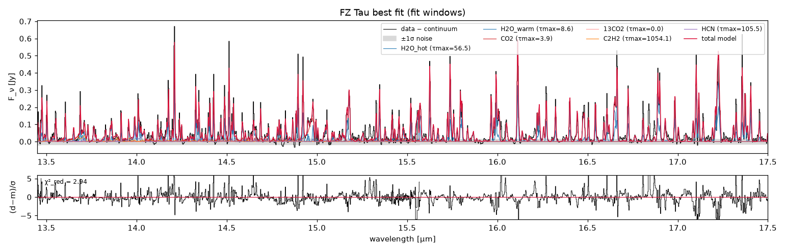</p>
<p align="center"><em>FZ Tau (JWST GO 1549), 13.45–17.5 µm, examples/05: data (black), components, total model (red) and residuals. Hot water: 925 K, log N = 18.8, R = 0.26 au. Warm water: 506 K, log N = 18.6, R = 0.78 au. CO₂ (with ¹³CO₂ tied at 1/70): 486 K, log N = 17.35, R = 0.23 au. The weak C₂H₂ and HCN end at the bounds of the example config, i.e. they are not constrained by this window (see examples/README.md).</em></p>

<p align="center">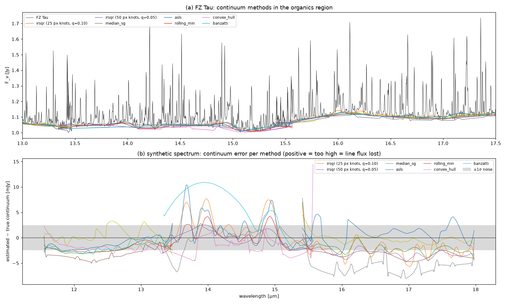</p>

<p align="center">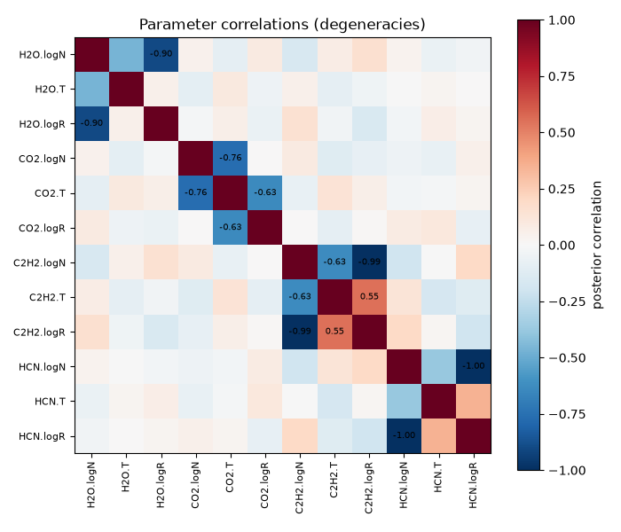</p>
<p align="center"><em>Posterior correlations of the synthetic fit: N–R ridges within optically thin components, T–N within components, and weaker cross-molecule terms.</em></p>

---

## Output files

A run writes everything to its own folder, `output:` with `{target}` replaced by the source name. The
default `results/{target}` gives `results/FZ_Tau/`, `results/DR_Tau/`, and so on. The name is `target.name`,
or the FITS `TARGNAME` when no name is set; `V* FZ Tau` becomes `FZ_Tau`. The terminal and the web app
print the folder when a run starts. To keep several models of one source apart, use for example
`output: results/{target}/water_hot_cold`. A batch run writes `population.csv` to the common parent
folder (`results/`). A path without `{target}` is used exactly as written; batch runs then add one
sub-folder per target.

| File | Content |
| --- | --- |
| `config.yaml` | the exact config of the run (re-run it with `jalebi fit`) |
| `prep.csv` | wave, flux, err, band, continuum, mask |
| `best_fit.json` | parameters (ties resolved), χ², χ²_red, τ_max per unit |
| `model.csv` | wave, data, σ, model on the fitted pixels |
| `fit_windows.png`, `fit.png` | data, components, total and residuals: the fit windows and the full spectrum |
| `grid_<comp>.npz/.png` | the (log N, T) χ² maps |
| `summary.csv` | posterior medians, 16/84 %, bounds, `at_edge`, derived quantities |
| `diagnostics.json` | acceptance, τ, R̂, n_eff, burn-in, runtime |
| `tau_flags.json` | fraction of posterior samples with τ_max < 1 per unit |
| `correlation.csv`, `correlation.png`, `corner.png`, `traces.png`, `posterior_predictive.png` | posterior figures |
| `chain.npz`, `chain.h5` | the full chain (and its checkpoint) |
| `detections.csv`, `detection.csv` | ΔBIC test of the fitted components; the auto-detection table |
| `log.txt` | the run log |
| `population.csv` | batch mode, in the parent folder (`results/`): one row per target with every summary column, convergence and ΔBIC |

`jalebi cube` runs write to `results/{target}/cube/` by default (the same one-folder-per-source rule as the
fits), one sub-folder per line (`<line>/`: FITS maps with WCS, `*_all_maps.fits`,
integrated spectra, `*_summary.json`, `*_maps.png`, channel maps and PV cuts), `regions/` (DS9 file, region
spectra as CSV, overview figure), `line_summary.csv` and `cube_config_used.yaml`; see
[`docs/CUBE.md`](docs/CUBE.md) §4.

---

## Validation

The test suite (`pytest -q`, about 20 s, offline) checks:

- the optically thin line flux against the analytic formula, to better than 0.2 %;
- flux conservation of the LSF + pixel operator, and that its rows sum to 1;
- the curve of growth, the linearity of the areas and the NNLS recovery;
- velocity shifts, opacity groups, isotopologue ties in the area solve, and annuli outer radii;
- every continuum method on a toy spectrum;
- config round trips and every bundled line list, partition function and example config;
- the user-cache precedence rules;
- detection of injected species;
- optimiser recovery of a synthetic CO₂ slab (T within 40 K, log N within 0.25 dex, log R within 0.1 dex);
- MCMC summaries, the CLI and `jalebi doctor`;
- `jalebi.cube` on synthetic cubes with known answers (point source + Keplerian ring + jet, PSF convolved
  plane by plane): point-source and extended fluxes, calibrated Monte Carlo velocity errors (pull σ ≈ 1),
  ring rotation, an injected sub-band offset, resampling wiggles, stacking, channel maps, PV cuts, regions,
  FITS WCS, and the HV Tau C jet; the numbers are in [`docs/CUBE.md`](docs/CUBE.md#3-validation);
- `jalebi.rotdiag`: the H₂ level sums against HITRAN's Q(T) and the LTE OPR, the curve of growth, extinction
  curves, injection–recovery of one- and two-temperature and power-law H₂ diagrams with A_V and a free OPR, full LTE
  slab spectra (thin H₂; optically thick CO with and without the opacity correction), flux tables, the pipeline, the
  CLI and the web-app modules (a cube region sent to the rotation diagram); numbers in
  [`docs/ROTDIAG.md`](docs/ROTDIAG.md#8-validation).

GitHub Actions run the suite on Linux and macOS with Python 3.10–3.14, and also build and install the
wheel in a clean environment.

**Injection–recovery on the bundled synthetic spectrum** (MIRI channel 3, S/N 150, window 13.6–16.3 µm,
starting values off by 50–150 K and 0.5 dex). The fit was run twice: once with the true continuum
subtracted, which isolates the fitting machinery, and once with the continuum estimated by the example
config (IRSQR with 50-pixel knots, quantile 0.05, one model-aware refinement pass), which is what you get on
real data:

| Component | Parameter | Truth | True continuum | Estimated continuum |
| --- | --- | ---: | ---: | ---: |
| H₂O | T [K] | 550 | 549 (-5/+5) | 553 (-5/+5) |
|  | log N [cm⁻²] | 18.00 | 17.97 (-0.06/+0.06) | 18.00 (-0.05/+0.05) |
|  | log R [au] | -0.30 | -0.29 (-0.02/+0.02) | -0.30 (-0.02/+0.02) |
|  | log N·A | 17.90 | 17.88 (-0.02/+0.03) | 17.89 (-0.02/+0.02) |
| CO₂ | T [K] | 450 | 467 (-9/+10) | 444 (-10/+11) |
|  | log N [cm⁻²] | 17.50 | 17.44 (-0.05/+0.05) | 17.66 (-0.04/+0.05) |
|  | log R [au] | -0.70 | -0.70 (-0.01/+0.01) | -0.72 (-0.01/+0.01) |
|  | log N·A | 16.60 | 16.53 (-0.04/+0.04) | 16.71 (-0.05/+0.05) |
| C₂H₂ | T [K] | 650 | 642 (-27/+26) | 558 (-24/+26) |
|  | log N [cm⁻²] | 16.80 | 16.42 (-0.72/+0.31) | 16.46 (-0.44/+0.24) |
|  | log R [au] | -0.90 | -0.73 (-0.13/+0.34) | -0.74 (-0.09/+0.19) |
|  | log N·A | 15.50 | 15.46 (-0.05/+0.06) | 15.48 (-0.06/+0.07) |
| HCN | T [K] | 750 | 795 (-30/+33) | 770 (-38/+33) |
|  | log N [cm⁻²] | 16.60 | 15.63 (-0.53/+0.69) | 16.12 (-0.79/+0.77) |
|  | log R [au] | -0.80 | -0.33 (-0.34/+0.26) | -0.61 (-0.35/+0.39) |
|  | log N·A | 15.50 | 15.46 (-0.02/+0.02) | 15.41 (-0.03/+0.06) |

Medians with the 16th/84th-percentile offsets; 32 walkers × 2000 steps. χ²_red is 0.86 with the true continuum and 1.13 with the estimated one. The thin-limit ridges of C₂H₂ and HCN have long autocorrelation times (≈200 steps, so about 9 τ), so the error bars are indicative. For publication, run until the chain is ≥ 50 τ long (here ~10 000 steps).

With the true continuum every parameter is recovered within 2σ. C₂H₂ and HCN are nearly
optically thin here ($\tau_\text{max} \approx 1$), so their $N$ and $R$ are individually broad and anti-correlated
(correlation −0.99, see the figure above) while `log N·A` is pinned to ±0.05 dex. That is the thin-limit
[degeneracy](#degeneracies-what-a-slab-fit-can-and-cannot-tell-you) the posterior is meant to show. With the
*estimated* continuum, water is unchanged, but the CO₂ column comes out 0.16 dex high and the C₂H₂
temperature 90 K low, several times their statistical errors. On real spectra the continuum placement,
not the sampler, dominates the error budget of blended bands. Compare two continuum settings before you
quote C₂H₂ or HCN temperatures (examples/03).

---

## Project layout

```text
jalebi/
├── install.py · install.sh · install.bat     interactive installer (standard library only)
├── pyproject.toml · requirements*.txt · environment.yml
├── README.md · DATA_LICENSES.md · CHANGELOG.md · CONTRIBUTING.md · CITATION.cff · LICENSE
├── src/jalebi/
│   ├── model.py        slabs, opacity basis, units, annuli, NNLS areas
│   ├── instrument.py   MRS resolving power, LSF + pixel operator
│   ├── linedata.py     line lists: bundled + user cache, HITRAN download, .par import
│   ├── partition.py    Q(T): list tables, TIPS-2021 via HAPI
│   ├── molecules.py    registry, default windows, spectral features
│   ├── data.py         x1d / s3d / CSV input, rest frame, spikes, noise
│   ├── continuum.py    7 continuum methods, protected ranges, masks
│   ├── fit.py          parameters, priors, likelihood, grid, DE, emcee, diagnostics
│   ├── detect.py       automatic molecule detection
│   ├── pipeline.py     prep -> grid -> optimise -> mcmc -> results (shared by CLI/app)
│   ├── plots.py        figures
│   ├── config.py       validated YAML
│   ├── cli.py          the `jalebi` command
│   ├── app.py          the web app
│   ├── lines.py        line catalogue (H2, fine-structure, H I), batched Gaussian fits, one-line fits
│   ├── cube/           line maps from IFU cubes: io, continuum, psf, maps, channels, regions, plots,
│   │                   config, pipeline, synthetic, cli (`jalebi cube`), app (the Cube maps module)
│   ├── rotdiag/        rotation diagrams: species, extinction, features, measure, physics, fit, config,
│   │                   pipeline, plots, synthetic, cli (`jalebi rotdiag`), app (the Rotation diagram module)
│   ├── modules.py      the modules of the web app (registry)
│   ├── synthetic.py    synthetic spectra with known answers
│   ├── doctor.py       installation checks
│   ├── examples.py     bundled data paths, `example:` prefix, copying the examples
│   ├── linedata/       bundled line lists (Parquet, 27 MB)
│   ├── example_data/   FZ Tau x1d files, HV Tau C cube cutouts, synthetic spectrum + truth + config
│   └── data_files/     continuum windows and water line tables (Banzatti+2025)
├── examples/           scripts 01–09, configs/, notebooks/
├── tests/              pytest suite
├── docs/               images, CUBE.md (cube maps), ROTDIAG.md (rotation diagrams), ABSORPTION.md,
│                       VERSION_CONTROL.md (releases), GitHub guide
└── .github/            CI, PyPI publishing, issue templates
```

---

## Citing JALEBI

If JALEBI helps your research, please cite the software (`CITATION.cff`; GitHub shows a *Cite this
repository* button), and also cite:

- the **line lists**: HITRAN2020 (Gordon et al. 2022), HITEMP (Rothman et al. 2010; Li et al. 2015 for
  CO), TIPS-2021 (Gamache et al. 2021) and HAPI (Kochanov et al. 2016);
- **emcee** (Foreman-Mackey et al. 2013);
- the **methods** you used: e.g. Argyriou et al. (2023) for the resolving power, Banzatti et al. (2025) for
  the continuum windows, the JDISCS/MINDS papers whose approaches you follow;
- for the FZ Tau example data, JWST GO 1549 and Pontoppidan et al. (2024).

## Related tools

JALEBI follows established slab-fitting practice and sits alongside other tools:
[iSLAT](https://github.com/spexod/iSLAT) (interactive slab fitting),
[spectools_ir](https://github.com/csalyk/spectools_ir) (slab models and line analysis), and
DuCKLinG (Kaeufer et al. 2024; Bayesian fits of dust and gas together). Its focus is fitting many
molecules simultaneously, with areas profiled by NNLS, parallel posterior sampling, automatic
detection, and one config shared by the terminal, Python and a web app.

## License

The code is BSD 3-Clause (`LICENSE`). The bundled line lists and the FZ Tau data keep their original
terms and credits; see [DATA_LICENSES.md](DATA_LICENSES.md).

## Acknowledgements

This work uses observations made with the NASA/ESA/CSA James Webb Space Telescope, obtained from the
Mikulski Archive for Space Telescopes at STScI, which is operated by AURA under NASA contract NAS 5-03127.
They are associated with program 1549. JALEBI uses numpy, scipy, pandas, astropy, emcee, corner,
matplotlib, pybaselines, pydantic, typer, rich, Panel and Bokeh, and the HITRAN databases.

## References

- Argyriou, I. et al. 2023, A&A 675, A111 — *JWST MIRI flight performance: the Medium-Resolution Spectrometer*
- Banzatti, A. et al. 2023, ApJL 957, L22 — cool water excess in compact disks
- Banzatti, A. et al. 2025, AJ 169, 165 — *Water in protoplanetary disks with JWST-MIRI: spectral excitation atlas…*
- Carr, J. S. & Najita, J. R. 2008, Science 319, 1504
- Chiar, J. E. & Tielens, A. G. G. M. 2006, ApJ 637, 774 — mid-IR extinction, local ISM
- Foreman-Mackey, D. et al. 2013, PASP 125, 306 — emcee
- Francis, L. et al. 2025, A&A — JOYS: the [D/H] abundance from protostellar outflows (H₂ diagrams with A_V and the ln(OPR/3) correction)
- Fritz, T. K. et al. 2011, ApJ 737, 73 — Galactic-centre extinction curve
- Gamache, R. R. et al. 2021, JQSRT 271, 107713 — TIPS-2021
- Gelman, A. & Rubin, D. B. 1992, Statistical Science 7, 457
- Gelman, A. et al. 2013, *Bayesian Data Analysis*, 3rd ed. (CRC Press) — split-R̂
- Goodman, J. & Weare, J. 2010, Comm. App. Math. Comp. Sci. 5, 65
- Gordon, I. E. et al. 2022, JQSRT 277, 107949 — HITRAN2020
- Gordon, K. D. et al. 2021, ApJ 916, 33; 2023, ApJ 950, 86; 2024, JOSS 9, 7023 — extinction curves and `dust_extinction`
- Goldsmith, P. F. & Langer, W. D. 1999, ApJ 517, 209 — population diagrams with optical-depth corrections
- Jones, O. C. et al. 2023, MNRAS 523, 2519 — MRS resolving power
- Kaeufer, T. et al. 2024, A&A — *Bayesian analysis of the molecular emission and dust continuum of protoplanetary disks* (DuCKLinG)
- Kochanov, R. V. et al. 2016, JQSRT 177, 15 — HAPI
- Lahuis, F. & van Dishoeck, E. F. 2000, A&A 355, 699 — ISO absorption bands of C₂H₂, HCN and CO₂ toward massive protostars (slab absorption model)
- Law, D. R. et al. 2023, AJ 166, 45 — MRS cubes and PSF
- Lawson, C. L. & Hanson, R. J. 1974, *Solving Least Squares Problems* (NNLS)
- Neufeld, D. A. & Yuan, Y. 2008, ApJ 678, 974 — power-law temperature distributions of shocked H₂
- Pachucki, K. & Komasa, J. 2018, PCCP 20, 247 — H₂ level energies
- Li, G. et al. 2015, ApJS 216, 15 — CO line list
- Li, J., Boogert, A. C. A. & Tielens, A. G. G. M. 2024 — gas-phase absorption toward embedded protostars with JWST: $F = F_c\,[1 - f_c(1 - e^{-\tau})]$
- Pontoppidan, K. M. et al. 2024, ApJ 963, 158 — *High-contrast JWST-MIRI spectroscopy of planet-forming disks for the JDISC Survey*
- Pound, M. W. & Wolfire, M. G. 2023, AJ 165, 25 — PDR Toolbox / pdrtpy (H₂ excitation fits)
- Rothman, L. S. et al. 2010, JQSRT 111, 2139 — HITEMP
- Roueff, E. et al. 2019, A&A 630, A58 — the full infrared spectrum of H₂ (bundled line list)
- Salyk, C. et al. 2011, ApJ 731, 130
- Storn, R. & Price, K. 1997, J. Global Optimization 11, 341 — differential evolution
- Tabone, B. et al. 2021, A&A 650, A192 — OH prompt emission from water photodissociation
