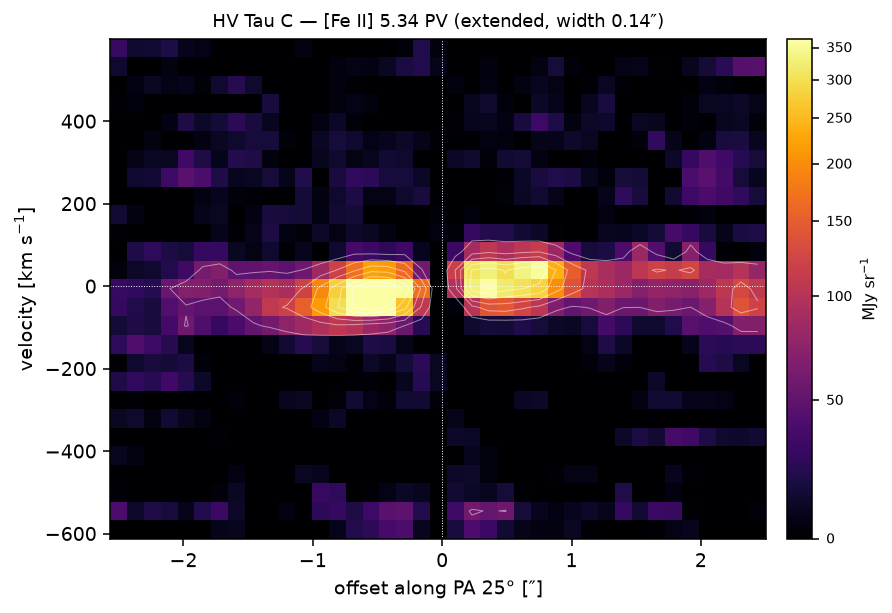

# Line maps and velocity maps from IFU cubes (`jalebi.cube`)

Most Class II disks are unresolved in the MIRI continuum, so the maps that matter show **extended line
emission** — jets, winds, H₂, [Ne II], [Fe II], CO — once the point source is removed. `jalebi.cube` does
this for JWST `s3d` cubes (MIRI-MRS; NIRSpec-IFU cubes read the same way) and ties the result back to the
slab fit: any region drawn on a map becomes a spectrum that the normal LTE fit runs on.

Everything is available three ways, with the same settings and the same results:

| | |
| --- | --- |
| **Terminal** | `jalebi cube info / lines / maps / stack / channels / pv / ratio / moment0 / region / cutout / synth / run / demo` |
| **Python** | `from jalebi import cube` → `CubeSet`, `prepare_line`, `line_maps`, `stack_lines`, `channel_maps`, `channel_slices`, `pv_diagram`, `ratio_map`, `region_spectrum`, `run_cube`; the old `cube_maps.py` functions in `jalebi.cube.cube_maps` (§6) |
| **Web app** | `jalebi serve --tab cube`: the *Cube* workspace (map view, click a spaxel, draw a region, send it to the slab fit). It shows the equivalent command and Python code for what is on screen, and exports the cube config YAML |

The bundled example is **HV Tau C** (MINDS, JWST PID 1282): five cutouts around [Fe II] 5.34, H₂ S(3),
S(2), S(1) and [Ne II] 12.81 µm. `jalebi cube demo` runs everything on it in about 30 s.

---

## 1. The method

### 1.1 Which cube, which window

`CubeSet(folder)` reads only the headers of every `*_s3d*.fits[.gz]` file (sub-band from `CHANNEL`/`BAND`,
wavelength axis from the header or the jwst `WAVE-TAB` table). For a line at rest wavelength λ₀ and
systemic velocity v_sys it picks the cube that covers λ₀(1 + v_sys/c) with the widest margin and cuts the
slab λ₀(1 + (v_sys ± window)/c), ±1500 km/s by default. Spaxels flagged `DO_NOT_USE` in DQ (or exactly 0)
become NaN (`dq_mask: false` and `zero_is_nan: false` keep them, as spectral_cube does).

`window_um: 0.1` cuts ±0.1 µm instead, with the planes chosen as spectral_cube's `spectral_slab` chooses
them (the planes nearest to λ₀ ± 0.1 µm and everything between) — the `dlambda` of `cube_maps.py`.
`band: nominal` picks the sub-band by the fixed boundaries of `cube_maps.py`'s `get_channel` (a line in
an overlap goes to the longer-wavelength sub-band), `band: 3A` (or `ch3-short`) forces one.

### 1.2 Per-spaxel local continuum

A full-spectrum continuum for every spaxel would be slow and is not needed for one line. For each spaxel,
a polynomial (order 1 by default, `continuum.order`) is fitted to the line-free channels on both sides of
the line, `inner_kms ≤ |v| ≤ outer_kms` (default max(250 km/s, 2 × instrumental FWHM) to 1200 km/s), with
the channels of every other catalogue line removed and two rounds of 3σ clipping. All spaxels are solved
at once (weighted normal equations), so a cube takes well under a second.

`method: aspls | irsqr | asls` runs a pybaselines baseline through *all* channels of each spaxel instead:
`aspls` with `lam = 5e6` is the continuum of the old `cube_maps.py`, `irsqr` with `lam = 1e3` the one of
the `channel_maps` notebook (one fit per spaxel, a few seconds per line; parallel with `n_jobs`). These
depend on the width of the window they see, so use them with `window_um: 0.1` to reproduce the old maps.
`nan_policy: propagate` gives no continuum to a spaxel with a NaN channel (what pybaselines did in the old
code); the default `omit` fits through the finite channels, which keeps a few more edge spaxels.

### 1.3 Point-source removal

The continuum image next to the line *is* the PSF at that wavelength for an unresolved disk — including
the MRS PSF's asymmetries and the cube-building artefacts of that sub-band. For every plane k of the
continuum-subtracted cube L:

    P_k(x, y) = C_k(x, y) − b_k          continuum model of the spaxel at λ_k, minus the median continuum
                                         far from every source (b_k: background residuals, a companion's halo),
                                         within 8 FWHM(λ_k) of the source (cosine taper over the outer 20 %)
    s_k       = Σ_core w L_k P_k / Σ_core w P_k²    least squares in the PSF core (r < 0.5 FWHM), w = 1/σ²
    E_k       = L_k − s_k P_k            extended emission

Because the template is the continuum *at the same wavelength*, the change of the PSF across a sub-band
(FWHM = 0.033 λ + 0.106″, Law et al. 2023) is followed plane by plane. s_k is the line-to-continuum ratio
of the unresolved emission, and s_k Σ P_k is the point-source line spectrum.

Other compact continuum peaks brighter than 10 % of the target (a binary companion — HV Tau AB is 4″ from
HV Tau C) are found and removed in the same way, each spaxel belonging to its nearest source
(`psf.auto_sources`, `psf.extra_sources: [[ra, dec], ...]`).

**Limitation.** Extended emission inside the core is absorbed into the point source, so E ≈ 0 there by
construction (the maps draw the core as a dotted circle). On the synthetic cubes this moves 1–19 % of the
extended flux into the point source, the most for the largest PSF (H₂ S(1), 0.67″) — see §3.

### 1.4 Noise

The pipeline `ERR` array misses the correlated noise of cube building. Each channel's uncertainty is
max(ERR, empirical rms of that spaxel's line-free residuals) (`noise: max`; `err` or `empirical` to use one).
The empirical term also carries the spaxel-to-spaxel "resampling wiggles" that a low-order polynomial does
not follow, so they raise σ instead of producing fake lines.

### 1.5 Moment maps

Over |v| ≤ `line_kms` (default max(200 km/s, 1.5 × instrumental FWHM)), or over native channels around the
channel nearest to the line (`component`, the windows of `cube_maps.py`): `full` = the central channel ± 4
(9 channels), `slow` = ± 2 (5 channels, the line core), `fast` = `full` − `slow` (the 2 + 2 wing channels).
`half_full` / `half_slow` change the 4 and 2. The central channel is found in the systemic frame, so
`zero_point: star` shifts the velocities but not the channels. A spaxel needs `min_valid` finite channels
in the window (default half of them, at least 3; `1` = spectral_cube's rule). A window cut by the edge of
the slab is summed over the channels that exist, with a warning (the old code stopped with an error for a
cut `fast` window).

    mom0 = Σ L_k Δλ_k × c/λ₀²          erg s⁻¹ cm⁻² sr⁻¹   (flux per spaxel: × PIXAR_SR × 10⁻³ → W m⁻²)
    mom1 = Σ v L Δλ / Σ L Δλ           km/s, spaxels with S/N(mom0) ≥ snr_min
    mom2 = √(Σ (v − mom1)² L Δλ / Σ L Δλ)

for the continuum-subtracted cube (`mom0`, `mom1`) and for the extended cube (`mom0_ext`, `mom1_ext`).

`LineMaps.native("mom0", "MJy/sr um")` gives moment 0 in the cube's units (∫I_ν dλ); `"MJy/sr m"` are the
numbers in the FITS files of `cube_maps.py` (§6). With `rms_region: [x, y, r]` (pixels of empty sky,
0-based, x = column) a `mom0_masked` map keeps mom 0 ≥ `rms_sigma` × the circle's nanstd (`rms_mode:
mean | median` for its mean or median), as `plot_moment0_map(sigma_clip=True)` did.
`cube.background_mask(img, sigma_thresh, box_size, filter_size)` is the mask of
`plot_moment0_map_with_bkgd_mask`: σ × nanstd of the Background2D map (photutils when installed, else a
transcription of photutils 3.0's algorithm that gives the same numbers).

### 1.5b Line-ratio maps

`cube.ratio_map(m1, m2, rms_region=(12, 8, 3), sigma_thresh=(5, 5))` (config `ratios:`, `jalebi cube
ratio`, the web app's *Masks and line ratio* panel) is `make_ratio_plot`: line 2 is reprojected onto the
spaxels of line 1 (bilinear, the same sampling as `reproject_interp`, which is used when installed), each
map is kept where it is ≥ σ × the nanstd of the RMS circle (or, without a circle, where S/N ≥ σ from the
propagated errors), and the ratio is taken where both survive and line 2 > 0. Output: `ratios/*.fits`
(RATIO, LINE1, LINE2 with line 1's WCS), a JSON summary and the three-panel PNG.

From `LineMaps` the maps are in erg s⁻¹ cm⁻² sr⁻¹, so the ratio is a **line-flux ratio**. The maps of
`cube_maps.py` are ∫I_ν dλ; their ratio is the flux ratio × (λ₁/λ₂)² (for [Fe II] 5.34 / [Ne II] 12.81,
× 0.17). `unit: "MJy/sr m"` reproduces those numbers.

### 1.6 Velocity maps: Gaussian centroids with Monte Carlo errors

The MRS resolves 85–200 km/s (R ≈ 1500–3700), so the kinematic information is in **centroid shifts**,
which a Gaussian fit measures to a few km/s at S/N ≳ 20 — not in the widths (mom2 and the fitted FWHM are
dominated by the instrument and are given for completeness). Per spaxel with S/N ≥ `kinematics.snr_min`
(default 5), a Gaussian is fitted with σ ∈ [0.8, 2.5] × σ_LSF (R from Argyriou et al. 2023) and the centre
within ±200 km/s. The fit is a bounded Levenberg–Marquardt solved for all spaxels at once
(`jalebi.lines.fit_gaussian_batch`). The error is the standard deviation over `n_mc` (default 100) noise
realisations of each spaxel, all refitted in one batch — about 10⁵ fits per second on one core. By
default the velocity fit uses the extended cube, except in the PSF core, where it uses the full line cube.

Products: `vcen`, `vcen_err`, `fwhm`, `fwhm_err`, `gflux`, `gflux_err`, `gchi2r`, `width_at_bound`.

### 1.7 Velocity zero points

Velocities are relative to λ₀ after removing `rv_kms` and a per-sub-band offset `band_offsets_kms`
(the MRS wavelength calibration differs by a few km/s between sub-bands). `zero_point: star` instead
measures the line's centroid in a 1-FWHM aperture on the source and subtracts it, per line, which removes
both the systemic velocity and the sub-band offset (the summary keeps the value: `zero_point_kms`).

### 1.8 Stacking lines of one species

`stack_lines(cs, ["H2 S(1)", "H2 S(2)", "H2 S(3)"])`: every line is continuum-subtracted on its own cube,
**aligned** so that its centroid on the source is at 0 km/s (removes the sub-band offsets, which would
blur the stack), normalised by its source-integrated flux, resampled to a common velocity axis (the
median channel width) and to the coarsest spaxel grid through the WCS, and averaged with 1/σ² weights. A
stack is in normalised units: its moment 0 is a shape, its velocities are real. On HV Tau C the H₂ stack
reaches 0.9–1.3 km/s where the single lines give 1.5–2.4 km/s.

### 1.9 Channel maps and PV cuts

`channel_maps(lc, vmin, vmax, dv)` integrates the (extended) cube in velocity bins (fractional channel
overlap) → FITS cube with a `VRAD` axis. `pv_diagram(lc, pa_deg, length_arcsec, width_arcsec)` samples
the cube along a cut through the source (PA east of north, positive offsets towards the PA), averaged
across the slit width (default 0.5 FWHM) → FITS with `OFFSET` × `VRAD` axes.

<p align="center"></p>
<p align="center"><em>[Fe II] 5.34 µm of HV Tau C along the jet (PA 25°), point source removed, v = 0 at the source:
the north-eastern lobe (positive offsets) is redshifted, the south-western lobe blueshifted.</em></p>

### 1.10 Region spectra → slab fit

`CircleRegion`, `EllipseRegion` (semi-axes, PA of the major axis east of north), `AnnulusRegion` and
`PolygonRegion` live on the sky (degrees, arcsec) and read/write DS9 fk5 strings. `region_spectrum(cs,
region)` sums every sub-band cube over the region through its own WCS (sub-pixel weights; planes with
< 80 % coverage are NaN) → a `jalebi.Spectrum` in Jy, which every slab-fitting function accepts:

```python
spec = cube.region_spectrum(cs, cube.offset_region("circle", star, 0.42, 0.91, 0.35))
run = jalebi.run_pipeline(cfg, spec=spec.to_rest_frame(cfg.target.rv_kms))
```

No aperture correction is applied (right for extended emission; for the point source itself use the
aperture-corrected `jalebi.data.load_s3d_folder`). In the web app, *Send to slab fit* loads the region
spectrum as the target of the Continuum / Model / Fit workspaces.

---

## 2. Known pitfalls and what the code does about them

| Pitfall | Handling |
| --- | --- |
| Resampling artefacts at the spaxel scale (cube building of an undersampled PSF: spaxel-to-spaxel wiggles in the continuum of a point source) | per-spaxel continuum (order 1–3, `continuum.order`); empirical noise floor per spaxel; optional spatial smoothing `smooth_fwhm_pix`; the synthetic test injects 3 % wiggles and checks that no fake extended line appears |
| Sub-band-to-sub-band wavelength offsets of a few km/s | `band_offsets_kms: {3A: 2.5, ...}`, or `zero_point: star` per line; stacks align each line on the source first |
| PSF changing across one sub-band | the PSF template is the continuum at the wavelength of each plane, so it changes with λ exactly as the data do |
| A brighter companion in the field (HV Tau AB) | the source is the continuum peak *nearest the header target*; companions are found and removed with their own scale |
| Diffuse continuum (background residuals, scattered light) in the template | the median continuum far from all sources is subtracted from the template |
| Correlated noise underestimated by ERR | noise = max(ERR, empirical rms) for maps; the 1-D line fitter does the same for region spectra |
| Extended emission inside the PSF core | cannot be separated from the point source; the core is marked on the maps, and the velocity map uses the full line cube there |

---

## 3. Validation

**Synthetic cubes** (`jalebi cube synth`, `tests/test_cube.py`): three sub-bands (2B, 3A, 3C) with a point
source (continuum + unresolved lines), a Keplerian H₂ ring (r = 1″, i = 50°, PA 30°, v_K = 60 km/s) and a
bipolar [Ne II] jet (±150 km/s, knots at 0.8″ and 1.6″), PSF convolved plane by plane, 15 MJy/sr noise.
Mean over three noise seeds:

| line | point-source flux bias | extended flux bias | median \|v − v_true\| | pull σ (MAD) | median σ_v |
| --- | --- | --- | --- | --- | --- |
| H₂ S(3) 9.66 µm | +1.0 % | −0.6 % | 0.24 km/s | 0.95 | 0.38 km/s |
| H₂ S(2) 12.28 µm | +4.1 % | −1.6 % | 0.22 km/s | 1.02 | 0.34 km/s |
| [Ne II] 12.81 µm | +0.6 % | −10 % (knot inside the core) | 0.25 km/s | 0.96 | 0.36 km/s |
| H₂ S(1) 17.03 µm | +19 % (ring inside the 0.67″ core) | −6 % | 0.31 km/s | 1.6 | 0.26 km/s |

The true velocity here is the flux-weighted velocity of the noiseless PSF-convolved extended emission, so
sub-km/s differences from a Gaussian centroid are expected where the PSF mixes velocities. Other tests:
source position to < 0.05 spaxel, an injected +8 km/s sub-band offset recovered to < 1.5 km/s, stacking
three lines lowers the median velocity error, the ring's two sides have opposite signs, channel maps and
the PV cut of the jet show ±velocities on the two sides, region areas and DS9 round trips, FITS maps
reproduce the cube's WCS.

**HV Tau C** (bundled cutouts, `zero_point: star`): the [Fe II] 5.34 µm emission is a bipolar jet along
PA ≈ 25° (~90 % of the line flux is extended; north lobe +10 km/s, south lobe −24 km/s relative to the
source); [Ne II] is half point source, half jet; H₂ S(1)–S(3) are extended along PA ≈ 100–106° (84–92 % of
the flux), with an inner velocity gradient along the jet axis in the H₂ stack. The source velocities of
the five lines (+15 … +25 km/s) differ by more than their errors, which is the size of the sub-band
calibration offsets plus real line-to-line differences — one reason `zero_point: star` is the default in
the example.

---

## 4. Output files (per line, in `<output>/<line tag>/`; `output` defaults to `results/{target}/cube`, e.g. `results/HV_Tau_C/cube/`)

| File | Content |
| --- | --- |
| `<target>_<line>_{mom0,mom0_err,snr,mom0_ext,snr_ext,mom1,mom1_ext,mom2,peak,continuum,psf_model_mom0,flux_W_m2}.fits` | moment and flux maps (celestial WCS; CARTA/DS9 open them directly) |
| `<target>_<line>_{vcen,vcen_err,fwhm,fwhm_err,gflux,gflux_err,gchi2r,width_at_bound}.fits` | Gaussian-fit maps |
| `<target>_<line>_all_maps.fits` | every product as an extension of one file |
| `<target>_<line>_integrated.csv` | spectra summed over the field: data, continuum, line, point source, extended |
| `<target>_<line>_summary.json` | fluxes (total, point source, extended), source velocity, settings, companions, extendedness (flux inside 2 FWHM / 2–4 FWHM annulus) |
| `<target>_<line>_maps.png` | six-panel figure |
| `*_channels.fits/png`, `*_pv_PA<pa>.fits/png` | channel maps, PV diagram (when requested) |
| `<line>/channel_slices/<λ>.fits` | the native channels of the moment window, one 2-D FITS each, named by wavelength (`channels.slices: true`) |
| `<target>_<line>_mom0_masked.fits` | mom 0 masked with the RMS circle (`moments.rms_region`) |
| `ratios/<target>_<line1>_over_<line2>.{fits,json,png}` | line-ratio maps (`ratios:`) |
| `regions/regions.reg`, `regions/<name>_spectrum.csv`, `regions/regions.png` | regions (DS9), their spectra (loadable by every `jalebi` command), overview |
| `line_summary.csv`, `cube_config_used.yaml`, `run.json` | one row per line/stack; the exact config; run metadata |

---

## 5. References

- Argyriou, I. et al. 2023, A&A 675, A111 — MRS resolving power.
- Law, D. R. et al. 2023, AJ 166, 45 — MRS PSF FWHM (0.033 λ + 0.106″) and cube building.
- Labiano, A. et al. 2021, A&A 656, A57 — MRS wavelength calibration.

---

## 6. Coming from `cube_maps.py`

`jalebi.cube.cube_maps` keeps the functions of the old module with the same names, arguments, file
names and numbers; change one import:

```python
# from cube_maps import make_moment0, make_ratio_plot, plot_moment0_map, add_au_box
from jalebi.cube.cube_maps import make_moment0, make_ratio_plot, plot_moment0_map, add_au_box
```

| `cube_maps.py` | jalebi | terminal |
| --- | --- | --- |
| `get_channel(w)` | `cube.get_channel(w)`; `CubeSet.choose(w, band="nominal")` | `--band nominal` |
| `get_continuum(cube, wave)` (aspls, lam 5e6) | `cube_maps.get_continuum`; `continuum: {method: aspls}` | `--continuum aspls` |
| `make_moment0(lines, names, SOURCE, dlambda, component, save, folder_path, output_path)` → `(moment0, fname)` | same; or `prepare_line(..., window_um=0.1, continuum={"method": "aspls"})` + `line_maps(..., component="full")` | `jalebi cube moment0 DATA/SOURCE -l 5.3402=FeII --component full` |
| `get_moment0(df, ...)`, `get_moment0_all(df, ...)` | same (folders `moment0_maps/{component}/`, `all_species_m0_maps/{component}/`) | — |
| `make_ratio_plot(waves, names, source, ...)` | same (returns `(fig, RatioMap)`); `cube.ratio_map(m1, m2, ...)` | `jalebi cube ratio PATH -l L1 -l L2 --rms-region "12 8 3" --sigma 5,5` |
| `plot_moment0_map(fitsfile, ..., sigma_clip, sigma_mode, ...)` | same; `cube.plots.plot_map_wcs(data, wcs, ...)`; `line_maps(rms_region=...)` → `mom0_masked` | `moment0 --png --sigma-clip 3` |
| `plot_moment0_map_with_bkgd_mask(...)` | same; `cube.background_mask(img, ...)` | — |
| `add_au_box(ax, distance_pc, au_size, pixel_scale, ...)` | same (`cube.plots.add_au_box`) | — |
| `get_channel_maps(df, path, SOURCE, dlambda)` | same; `cube.channel_slices(lc, "full").write(dir)` | `jalebi cube channels PATH -l L --slices` |

Checked against the old code (spectral_cube 0.6.7, pybaselines 1.2, photutils 3.0, reproject 0.21) on the
five HV Tau C cutouts: the moment-0 maps of all 15 line/window combinations have identical NaN patterns
and agree to ≤ 6 × 10⁻⁷ of the peak (float32 rounding); the channel slices have the same file names and
agree to 5 × 10⁻⁷; the masked maps and the ratio of `make_ratio_plot` ([Fe II] / [Ne II], reprojected)
agree to 1.3 × 10⁻⁷; the Background2D thresholds are identical. `tests/test_cube.py` repeats the moment-0
comparison against an independent re-implementation of the old recipe.

Differences, all deliberate:

- **Units.** spectral_cube expresses the wavelength axis in metres and the continuum-subtracted cube had
  no unit, so the old files hold Σ I_ν [MJy/sr] × Δλ [m] with `BUNIT = 'm'` — 10⁻⁶ × the MJy/sr·µm the
  comments say. `make_moment0` writes the same numbers with `BUNIT = 'MJy m / sr'`; `unit="MJy/sr um"` or
  `"erg s-1 cm-2 sr-1"` give physical units, and `line_maps` uses erg s⁻¹ cm⁻² sr⁻¹. A ratio of the old
  maps is the flux ratio × (λ₁/λ₂)² (§1.5b).
- `get_channel` on an exact boundary (e.g. 5.66 µm) returns the next sub-band; the old strict inequalities
  returned `ch4-long`.
- `make_moment0` with several lines returns lists `(maps, fnames)`; the old one returned after the first.
- `get_channel_maps` picks the sub-band with `get_channel` (the old code had `channel = 'ch1-long'`
  fixed; pass `channel="ch1-long"` to keep that).
- The old default folders were paths on one computer; `folder_path` / `output_path` now default to the
  environment variables `JALEBI_CUBE_DATA` / `JALEBI_CUBE_OUTPUT`, else the current folder. A missing
  `Level3_{channel}_s3d.fits` falls back to any cube of that sub-band in the folder.
- A mismatched `names` list raises `ValueError` (the old code called `sys.exit` without importing `sys`).

The same recipe outside the old API: `--recipe cube_maps` for `jalebi cube maps / stack / ratio /
channels` (options after it override it), `cube.config.apply_recipe(cfg, "cube_maps")` in Python, the
*cube_maps.py recipe* button in the web app (it also ticks the *cube_maps.py NaN / zero rules* box), or
these config fields: `window_um: 0.1`, `band: nominal`, `dq_mask: false`, `zero_is_nan: false`,
`continuum: {method: aspls, lam: 5e6, nan_policy: propagate}`, `psf: {enabled: false}`,
`moments: {component: full, min_valid: 1}`. `tests/test_cube.py` checks that the terminal gives the same
maps as `make_moment0`.

What the old module did not have is one option away: point-source removal (`psf`), velocity maps with
Monte Carlo errors, S/N maps from the propagated errors, stacks, channel maps in velocity bins, PV cuts,
regions → slab fit. `jalebi cube init cube.yaml --example cube_maps` writes a config with the old recipe
(±0.1 µm, aspls, 9 channels, nominal sub-bands, no DQ mask, no PSF removal, the (12, 8, 3) RMS circle, an
[Fe II]/[Ne II] ratio) plus velocity maps; in the web app, the *cube_maps.py recipe* button sets the same.
