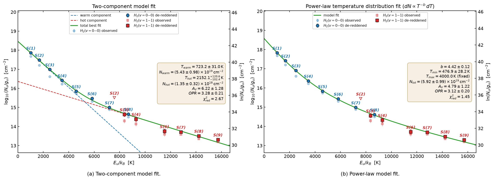
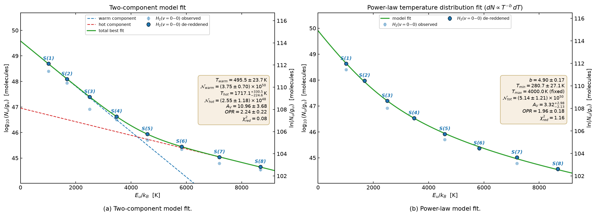

# Rotation diagrams (`jalebi.rotdiag`)

A rotation (population, excitation) diagram plots the column density per statistical weight of each upper
level, ln(N_u/g_u), against its energy E_u/k. In LTE at one temperature the points fall on a straight line of
slope −1/T. JWST papers use it for H₂ (winds, jets, outflows; T, N, A_V and the ortho-to-para ratio), CO
(rovibrational temperatures of the inner disk), OH (prompt emission from water photodissociation) and water.

The module picks the lines of a molecule inside your spectrum, measures them, and fits the diagram with the
physics written out below: one or two temperatures or a power-law temperature distribution, extinction, the
ortho-to-para ratio and optical depth, in flux space, with least squares and an MCMC.

```bash
jalebi rotdiag demo                                  # the bundled synthetic H2 spectrum: recovered vs true
jalebi rotdiag lines H2 example:FZ_Tau               # which lines would be used (blends, contaminants)
jalebi rotdiag fit example:FZ_Tau -m H2 --model two --opr species --av-free --mcmc --compare
jalebi rotdiag fit --fluxes my_h2.csv --flux-unit "1e-17 erg s-1 cm-2" -m H2 --model two --av-free --distance 140
jalebi rotdiag init rd.yaml --example h2  &&  jalebi rotdiag run rd.yaml
jalebi serve --module rotdiag                        # the web app's Rotation diagram module
```

```python
from jalebi.rotdiag import RotDiagConfig, run_rotdiag
res = run_rotdiag(RotDiagConfig(molecule="H2", spectrum={"path": "example:FZ_Tau"},
                                fit={"model": "two", "opr": "species", "av_free": True}))
print(res.fit.summary())                  # parameters, derived quantities
res.features                              # lines, fluxes, S/N, flags
res.fit.samples                           # the posterior (emcee)
```

Step by step: `find_features` → `measure_features` → `fit_rotation`.

## 0. Which spectrum: cubes, not x1d

For H₂, jets and anything extended, **use the `s3d` cubes** (`spectrum: {path: <cube folder>, source: s3d}`, the default
when the folder holds cubes): the flux is summed over a region of the sky in every sub-band (a circle of
`radius_arcsec` around the source by default; annulus, ellipse, polygon or `all` for the whole field), with no
background annulus, and the region's solid angle sets the aperture for beam-averaged column densities. The
pipeline's `x1d` extraction is a point-source aperture *minus a background annulus*: extended lines that are brighter
in the annulus than in the aperture come out **negative** (HV Tau C: S(2) and S(4) "in absorption"). The x1d path is
kept (`source: x1d`) for point sources and disks.

<p align="center"></p>
<p align="center"><em>HV Tau C (MINDS), H₂ summed over 1″ around the source in the s3d cubes: S(1)–S(8) of v=0–0 and S(3)–S(9) of
v=1–1, two temperatures (723 K, 2150 K, A_V 6.2 ± 1.3 with KP5, OPR 3.3) and a power law (b 4.4, T_min 480 K).</em></p>

---

## 1. Molecules and line lists

| molecule | default line list | default lines | spin species | notes |
| --- | --- | --- | --- | --- |
| **H₂** | Roueff et al. (2019), bundled (`roueff2019`) | v = 0–0 S(J) | ortho (odd J, g_I = 3) / para | quadrupole lines: always thin; S(3) at 9.66 µm sits in the silicate feature and pins A_V |
| **CO** | HITEMP (Li et al. 2015), bundled | v = 1–0 P/R | – | the low-J lines are often optically thick: use the opacity correction |
| ¹³CO | HITRAN 2020 | v = 1–0 | – | |
| **OH** | HITRAN 2020 | both X²Π ladders | – | Λ-doublets resolved; hyperfine components merged; the high-N lines (< 13 µm) are prompt (non-thermal) emission |
| **H₂O** | HITRAN 2020 (HITEMP also bundled) | the isolated lines of Banzatti et al. (2025) | ortho / para from g_u/(2J+1) | often optically thick |
| HCN, C₂H₂, CO₂, CH₄, NH₃, … | HITRAN 2020 | all | – | Q-branches are blends: the diagram is rarely useful |

Any molecule with a cached line list works (`jalebi linedata fetch …`). The **H₂ data** are new in 0.12: the
bundled HITRAN list stopped at 26 µm (no S(0)), so the full list of Roueff et al. (2019; CDS J/A+A/630/A58) is
bundled as the release `roueff2019` — all 4712 electric-quadrupole and magnetic-dipole lines of the X state,
energies of Pachucki & Komasa (2018) — together with the 302 bound levels, from which the ortho and para
partition functions are summed exactly (Q agrees with HITRAN/TIPS to < 0.1 % up to 1000 K; OPR_LTE(100 K) = 1.59,
→ 3 above 300 K).

## 2. Selecting the lines

`find_features(molecule, spectrum, Selection(...))`:

1. lines inside the spectrum, at least `edge_fwhm` (3) resolution elements from a sub-band edge, in the chosen
   vibrational bands (`bands`, e.g. `["0-0"]` for H₂, `["1-0", "2-1"]` for CO), below `eu_max`;
2. ranked by the optically thin LTE intensity at the ranking temperature `t_ref` (H₂ 800 K, CO 1000 K, OH 1500 K,
   H₂O 600 K), I ∝ g_u A ν e^(−E_u/kT) / Q(T); features weaker than `rel_min` (10⁻³) of the strongest are dropped,
   at most `max_features`;
3. lines of the molecule closer than `blend_fwhm` (0.5) instrumental FWHM are one **feature** whose flux is the
   sum of its members (weaker members down to `member_rel` of the strongest); the diagram point of a feature is

   N_u/g_u = 4π F / (h ν Ω Σ g_i A_i),  E_u = Σ g_i A_i E_i / Σ g_i A_i,

   and the model always predicts Σ_i F_i, so a blend is fitted exactly;
4. flags: `neighbours` (other features within 1.5 FWHM), `contaminants` (lines of other species within 1 FWHM:
   fine-structure lines, H I, the Banzatti et al. 2025 MIRI list), and blends of the molecule that are not
   features (other vibrational bands, e.g. CO v = 2–1 next to a v = 1–0 line), which are fitted as extra profiles.

The resolving power is the MIRI-MRS R(λ) of Argyriou et al. (2023) (`jones2023` also available), or a constant R
(`resolving_power: 2700` for NIRSpec G395H).

## 3. Measuring the fluxes

`measure_features(spectrum, features, members, MeasureConfig(...))`, for each feature in the sub-band where it
sits furthest from the edges, over ± `window_fwhm` (8) FWHM:

- **profile**: every member line as a pixel-integrated Gaussian at its rest wavelength shifted by one velocity v,
  of width s × the instrumental σ, weighted by the thin intensity ratios (one profile of unit area per feature);
- neighbouring features, blends of the molecule and known contaminants within `joint_fwhm` (2) FWHM get their own
  profiles; a polynomial baseline of order `cont_order` (1) is fitted at the same time, and pixels of stronger
  unmodelled lines (e.g. water lines in a disk spectrum) are clipped iteratively;
- the fit is **linear** in the amplitudes and the baseline, so the flux error is exact (covariance matrix) with the
  pixel errors max(pipeline error, the local scatter), scaled by √χ²_red when that exceeds 1; pixels within 2.5 FWHM
  of a modelled line are never clipped;
- strong lines (S/N ≥ `refine_snr`, 15, or a poor template fit) get their **own velocity and width** by profile
  likelihood (± `refine_kms`, 80 km/s): the MRS sub-bands have velocity offsets of 10–20 km/s and the true resolving
  power departs from the R(λ) law; a line with another known line within 2 FWHM keeps the global velocity instead;
- a feature with a known line of another species within half a resolution element is **blended**: measured, shown,
  but left out of the fit (`use` false; tick it back in the app) — e.g. H₂ v=1–1 S(1) under [Fe II] 17.94 µm;
- **v and s** (`velocity: auto`, `width: auto`) come from the profile likelihood of this same template on the
  strongest features (v on a ±100 km/s grid; s per MRS channel, because the true resolving power departs from any
  R(λ) law differently in each channel); fix them for weak spectra or jets with known velocities;
- `method: integrate` sums F − baseline over the feature window (the Banzatti et al. 2025 windows for the curated
  H₂O list, else ± 1.2 FWHM); `method: gauss_free` lets each centre and width float;
- `continuum: spectrum` uses the continuum stored with the spectrum (e.g. the one estimated in the LTE-fit module,
  or a `continuum` column of a CSV) instead of the local baseline;
- a feature is **detected** at S/N ≥ `snr_detect` (3); non-detections stay in the fit with their measured flux and
  error (that is the correct likelihood for an upper limit) and are drawn as 3σ upper limits.

## 4. The physics

### Populations

For an upper level u of spin species s (ortho/para for H₂ and H₂O, none otherwise):

| model | N_u / g_u |
| --- | --- |
| `single` | N · φ_s · e^(−E_u/kT) / Q_s(T) |
| `two` | the sum of a warm (T₁) and a hot (T₂ > T₁) term, sharing A_V and the OPR |
| `powerlaw` | N ∫ p(T) φ_s e^(−E_u/kT)/Q_s(T) dT with p(T) ∝ T^(−b) on [T_min, T_max] (Neufeld & Yuan 2008), N = column above T_min |

**Ortho-to-para ratio** (`opr:`):

- `thermal`: ortho and para in LTE at T, φ_s/Q_s = 1/Q (OPR = Q_o/Q_p, which is 1.59 at 100 K and 3 above 300 K for H₂);
- `species`: φ_o = OPR/(1+OPR), φ_p = 1/(1+OPR), and each spin species in LTE at T within itself, so N_o/N_p = OPR
  exactly, at any temperature (exact spin-resolved partition sums for H₂; the high-T split Q_o = ¾ Q for H₂O);
- `offset`: N e^(−E_u/kT)/Q(T), times OPR/3 on the ortho levels — the z(J) = ln(OPR/3) correction of e.g. Francis
  et al. (2025, JOYS) and pdrtpy; identical to `species` above ~300 K (checked in the tests).

### Line fluxes

Column mode (N in cm⁻², emitting solid angle Ω) and number mode (N = number of molecules, distance d):

  F_i = h ν_i A_i g_i (N_u/g_u) · Ω/4π · 10^(−0.4 A_V k(λ_i))  or  F_i = h ν_i A_i g_i (N_u/g_u) / (4π d²) · 10^(−0.4 A_V k(λ_i))

`geometry.mode`: `number` (molecules; needs d — the usual choice for unresolved disks), `radius` (Ω = π R²/d², N in
cm⁻²), `aperture` (Ω of the extraction aperture or a cube region: beam-averaged column density — set automatically
when a region is sent from the Cube module), `intensity` (a spectrum in MJy sr⁻¹, Ω = 1 sr).

**Extinction** k(λ) = A_λ/A_V (`fit: {extinction: ...}` or the app's *extinction curve* dropdown; `jalebi rotdiag curves`
prints A_K/A_V and the values at S(3) and S(1)):

| name | curve | A_K/A_V | A(9.66)/A_V | for |
| --- | --- | --- | --- | --- |
| `KP5` (default) | Pontoppidan et al. (2024, RNAAS): dense clouds and protostellar envelopes, with ices; used by JOYS and JDISCS | 0.159 | 0.164 | embedded sources, outflows |
| `KP5_benchmark` | the benchmark variant of the same model | 0.155 | 0.167 | |
| `McClure09` | McClure (2009, ApJS 181, 360) for A_K > 1 (`McClure09_low` for A_K 0.3–1); A_V/A_K = 7.75 | 0.129 | 0.093 | dense clouds |
| `HD23` | Hensley & Draine (2023, ApJ 948, 55) astrodust model | 0.096 | 0.090 | diffuse ISM |
| `G23` | Gordon et al. (2023, ApJ 950, 86), Milky Way average, R_V = 3.1 | 0.107 | 0.084 | diffuse ISM |
| `G23_Rv5.5`, `G21`, `CT06`, `F11` | Gordon+2023 R_V 5.5; Gordon+2021; Chiar & Tielens 2006; Fritz+2011 | | | |

The ln(N_u/g_u) points are shifted by −0.921 A_V k(λ); for H₂ only S(3) (9.66 µm, silicate feature) breaks the degeneracy
between A_V and T, so **A_V depends on the curve** while T and N barely do: HV Tau C (1″) gives A_V = 6.2 (KP5),
10.7 (G23), 11.7 (HD23), 16.3 (McClure09) for T₁ = 720–760 K in all four. Any other curve: the path of a CSV with two
columns, λ [µm] and A_λ/A_V (or A_λ/A_K with `normalise="K"` in `get_curve`).

**Optical depth** (`opacity: true`): a slab with a Gaussian velocity distribution of intrinsic FWHM Δv (`fwhm_kms`;
not the instrumental width) has the line-centre optical depth

  τ₀ = A c³/(8π ν³) · g_u (N_u/g_u) (e^(hν/kT) − 1) / (σ_v √(2π)),  σ_v = Δv/2.3548,

and the flux is reduced by the curve of growth f(τ₀) = ∫(1 − exp(−τ₀ e^(−x²))) dx / (√π τ₀) (→ 1 when thin,
≈ 2√(ln τ₀)/(√π τ₀) when thick). Then N, T and the area are no longer degenerate: fit R (`R_free`) or Δv
(`fwhm_free`) when the thick lines constrain them. This is the same slab physics as jalebi's spectral fit.

### Likelihood

  χ² = Σ_k (F_obs,k − F_model,k)² / (σ_k² + (f_sys F_obs,k)²),  f_sys = `sys_frac` (0.10: the relative
  spectro-photometric accuracy of MIRI-MRS between sub-bands; set 0 for synthetic data).

Fitting fluxes rather than log values keeps blends, non-detections, extinction and optical depth exact and avoids the
bias of log-transforming low-S/N points. Least squares (trust region, bounded, 10–20 starting points over the
temperature grid with the log N solved linearly at each start) gives the best fit and a covariance matrix; the MCMC
(`emcee`, vectorised over the walkers, flat priors inside the bounds, T₁ < T₂ for two components) gives the
posterior, the corner plot and the derived quantities with their uncertainties. `compare: true` (or *Compare
models* in the app) fits all three models and tabulates χ², BIC and AIC.

### Derived quantities

total column (column modes) or number of molecules, the other one when d or R is known, the gas **mass**
(M⊕; also M_Jup for H₂), the equivalent emitting radius of an aperture, A_K = A_V × (A_K/A_V of the curve), the hot
fraction N₂/(N₁+N₂), the LTE OPR at the fitted T (to compare with the fitted OPR), the column-weighted mean T of
a power law, the largest line-centre τ, and the de-reddened luminosity of the fitted lines (L⊙).

## 5. The web app module

`jalebi serve --module rotdiag` (or the *Rotation diagram* button in the header of the app). The app has three
modules, each with its own tabs: **LTE slab fit** (Data · Continuum · Model · Fit · Results · Batch), **Cube maps**
and **Rotation diagram**.

- Input: a file (default: the bundled synthetic H₂ spectrum), the LTE-fit target, a flux table, or a region sent
  from the Cube module (*Send to rotation diagram*; the aperture solid angle is set from the region area).
- Molecule and line list; picking a molecule sets the usual physics (H₂: two temperatures, free OPR and A_V;
  CO and H₂O: optical depth on; OH: two temperatures).
- ① Find lines → ② Measure → ③ Fit (least squares) → ④ MCMC, or *Run all*.
- Tabs: *Spectrum* (lines marked: detected / not detected / excluded; click one for its fit), *Lines* (the table;
  untick **use** to drop a line), *Rotation diagram* (points de-reddened by the fitted A_V, ortho/para or ladders
  coloured, upper limits, model curves per spin species and component, model points, residuals), *Posterior*
  (parameters, derived quantities, model comparison, corner plot), *Paper figure* (the two-panel figure below).
  *also fit a power law* (on by default for H₂) fits the power law next to the main model, overlays it (green) on the
  diagram and puts it in panel (b).

<p align="center"></p>
- Downloads: the config YAML (for `jalebi rotdiag run`), the line table, the fit results; *Write results folder*;
  the equivalent terminal command and Python code.

## 6. Configuration (`jalebi rotdiag init`)

```yaml
molecule: H2
release: null                  # line list (default per molecule: roueff2019 for H2)
spectrum: {path: example:FZ_Tau, rv_kms: 0.0, distance_pc: null}
fluxes: null                   # or {path: fluxes.csv, unit: "W m-2"}: columns label (S(1)...) or wave, flux, err
lines: {wmin: null, wmax: null, bands: null, eu_max: null, t_ref: null, rel_min: 0.001, max_features: 60,
        blend_fwhm: 0.5, curated: null, include: [], exclude: [], resolving_power: argyriou2023}
measure: {method: gauss, velocity: auto, width: auto, window_fwhm: 8, joint_fwhm: 2, cont_order: 1,
          continuum: local, snr_detect: 3, contaminants: true, flux_unit: Jy, use: null, skip: []}
geometry: {mode: number, distance_pc: null, R_au: 1.0, aperture_arcsec: 0.5, omega_sr: null}
fit: {model: two, opr: species, opr_value: 3.0, opr_free: true, av: 0.0, av_free: true, extinction: G23,
      opacity: false, fwhm_kms: 10.0, fwhm_free: false, R_free: false, sys_frac: 0.1, use: all,
      bounds: {T1: [100, 1500]}, fixed: {}, start: {}, compare: true, also: [powerlaw]}
mcmc: {enabled: true, walkers: 48, steps: 3000, burn: 1000, thin: 1, seed: 42}
output: results/{target}/rotdiag/{molecule}
```

Parameters: `logN` (`logN1`, `logN2`), `T` (`T1`, `T2`), `Tmin`, `Tmax`, `b`, `Av`, `OPR`, `logR`, `fwhm`; `bounds`,
`fixed` and `start` take these names.

## 7. Output (`results/{target}/rotdiag/{molecule}/`)

| file | content |
| --- | --- |
| `lines.csv` | features: label, λ, E_u, Σ gA, members, spin, flux, error, S/N, detected, used, flags, line velocity and width |
| `members.csv` | every line of every feature |
| `diagram.csv` | E_u, ln(N_u/g_u) (de-reddened), errors, upper limits, the model values |
| `fit.yaml`, `params.csv`, `derived.csv` | parameters (best, median, errors), χ², BIC, MCMC diagnostics; derived quantities |
| `compare.csv` | the model comparison |
| `chain.npz` | posterior samples and log-probabilities |
| `rotation_diagram.png` | the diagram in paper style: log₁₀ (left) and ln (right) axes, faint observed and solid de-reddened points per vibrational band (ortho points moved onto the para ladder when the OPR is fitted), labelled lines, warm/hot components dashed, the total in green, the parameters in a box |
| `rotation_diagram_models.png`, `fit_<model>.yaml`, `params_<model>.csv`, `derived_<model>.csv`, `corner_<model>.png` | with `fit: {also: [powerlaw]}`: the other models fitted too (+ MCMC) and drawn side by side — (a) two-component, (b) power law |
| `rotation_diagram_residuals.png`, `corner.png`, `line_fits.png` | ln diagram with residuals; posterior; the fit of every line |
| `summary.txt`, `rotdiag_config.yaml` | a readable summary; the config that made it |

## 8. Validation

All in `tests/test_rotdiag.py` (17 tests) unless noted.

- **H₂ partition sums**: the level sum equals the HITRAN/TIPS Q(T) to < 0.2 % at 100–1000 K; OPR_LTE(100 K) = 1.59.
- **Curve of growth**: series limit f = 1 − τ/(2√2) + τ²/(6√3) and the thick asymptote.
- **Injection–recovery** (the rotation-diagram physics, MRS pixels, noise): H₂ one temperature with A_V and a free
  OPR (logN 49.95 ± 0.05, T 706 ± 14 K, A_V 4.5 ± 1.2, OPR 1.96 ± 0.09 for 50.0, 700 K, 6, 2.0; line velocity
  13.5 km/s for 12); two temperatures, power law and the `offset` convention within 1.6σ of the truth. The bundled
  example (two components, A_V 10, OPR 2.3): T₁ 498 ± 24 K (480), T₂ 1740 ± 290 K (1600), A_V 11.0 ± 3.5, OPR
  2.26 ± 0.23; the model comparison prefers two components (ΔBIC 135 over one, 1.2 over a power law).
- **Independent physics** (full LTE slab spectra from `jalebi.model`, a different code path): thin H₂ at log N 22.0,
  800 K, R 3.2 au → 22.01 ± 0.007, 798 ± 3.5 K. Optically thick CO v = 1–0 (log N 18.5, 1100 K, R 0.1 au, Δv 4.7 km/s,
  τ₀ up to 10) → 18.504 ± 0.011, 1098 ± 3 K with the opacity correction (χ²_red 0.6); without it T = 1740 K and
  log N = 17.45 (χ²_red 70) — thick CO lines must not be fitted as thin.
- **pdrtpy 3.0.1** (Pound & Wolfire; H2ExcitationFit, log-space least squares, `offset` OPR convention) on the
  bundled flux table, same model (fitted here in log space for the comparison): identical T_cold, T_hot and OPR
  (391.7 / 1138.8 K, 2.103), columns within 1.6–2.7 % (partition functions). With A_V free (OPR fixed at 3), both give
  T = 469.8 / 1524.5 K, but pdrtpy's A_V is 2.30 × ours (23.2 vs 10.1; truth 10): pdrtpy subtracts 0.4 log₁₀(e) A_λ
  from log₁₀(N_u/g_u) where the correct term is 0.4 A_λ, so its A_V is a factor ln 10 too large. (pdrtpy is not a
  dependency; this check was run separately.)

## 9. Caveats

- LTE within each component: at low density the high-J H₂ lines are sub-thermal, OH prompt emission is not thermal
  at all, and CO vibrational levels can be radiatively pumped; the fitted T are then excitation temperatures.
- A_V from H₂ rests on S(3) and on the extinction curve: quote the curve, and try another one (KP5 and McClure09 differ by a factor 2.5 in A_V for the same data).
- Two temperatures and a power law are both approximations of a temperature distribution; the BIC says which one the
  data prefer, not which one is right.
- In disk spectra, H₂ and OH lines sit among water lines: look at the line fits (lines with `neighbours` or
  `contaminants` first), and drop blended lines (untick *use*, or `measure: {skip: ["S(4)"]}`). Fitting a spectrum
  from which the water model of the LTE slab fit has been subtracted is on the to-do list.
