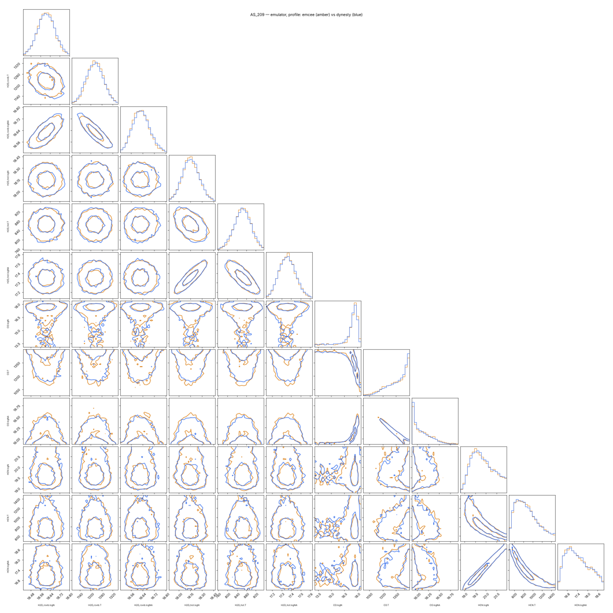

# Sampler benchmark: emcee vs dynesty (jalebi 0.20)

`runs/sampler_benchmark.py` (`list` · `run` · `report` · `evidence`). The cells measured in the cloud sandbox (one
core per run, 2-core machine, the 0.18 emulator) are below. The exact-model cells, the third dynesty seed and the
FZ Tau dynesty runs take hours, so they run with `runs/RUN_ME_sampler_benchmark.sh` (or
`runs/slurm_sampler_benchmark.sh`, one cell per array task). `report` then rewrites
`runs/results/sampler_benchmark/REPORT.md` with every finished cell.

## Setups

| disk | problem | free parameters (sample / profile) |
| --- | --- | --- |
| AS 209 | `results/validation_blind/AS_209` rebuilt from its config.yaml (after auto-detection), model.csv and best_fit.json: H2O ro-vib (4.9–9.5 µm) + hot water (HITEMP), CO, HCN; 1321 px in 66 line-region windows; start at the 0.15 optimum | 13 / 9 |
| FZ Tau | bundled MIRI x1d, FZ_Tau_quick continuum; two-T water (hot > warm, HITEMP), CO2 + ¹³CO2 (ratio 70 fixed), C2H2, HCN; 13.45–17.5 + 21–27 µm, 2677 px; start at the optimiser's result | 15 / 10 |

emcee: `moves: de`, `init: scaled`, `blocks: auto`, 6000 steps × max(4 ndim, 32) walkers per block. dynesty: dynamic,
`bound: multi`, `sample: rslice` (3 + d slices), nlive 500, posterior weight 0.8.

## Results (emulator backend)

| disk | sampler | linear | dims | wall [s] | CPU [s] | ln L calls | ESS | **ESS / CPU s** | τ max / med | steps/τ | max R̂ | ln Z ± err |
| --- | --- | --- | --- | --- | --- | --- | --- | --- | --- | --- | --- | --- |
| AS 209 | emcee | sample | 13 | 119 | 68 | 384 000 | 470 | 6.9 | 360 / 86 | 17 | 1.19 | — |
| AS 209 | emcee | profile | 9 | 143 | 84 | 384 000 | 1449 | 17.3 | 127 / 39 | 47 | 1.02 | — |
| AS 209 | dynesty | sample (seed 0) | 13 | 775 | 716 | 2 800 499 | 13 481 | 18.8 | — | — | — | 4035.18 ± 0.18 |
| AS 209 | dynesty | sample (seed 1) | 13 | 752 | 724 | 2 782 559 | 12 610 | 17.4 | — | — | — | 4034.58 ± 0.19 |
| AS 209 | dynesty | profile | 9 | 449 | 431 | 1 270 804 | 12 355 | **28.7** | — | — | — | 4057.10 ± 0.12 † |
| FZ Tau | emcee | sample | 15 | 221 | 205 | 360 000 | 1131 | 5.5 | 288 / 219 | 21 | 1.14 | — |
| FZ Tau | emcee | profile | 10 | 103 | 98 | 240 000 | 2092 | **21.4** | 110 / 85 | 54 | 1.05 | — |
| FZ Tau | dynesty | profile | 10 | > 420 (stopped) | | > 330 000 | | | — | — | — | (RUN_ME) |
| FZ Tau | dynesty | sample | 15 | > 2700 (stopped) | | | | | — | — | — | (RUN_ME) |

ESS: emcee = min over the sampled parameters of (steps − burn-in) × walkers / τ; dynesty = Kish ESS of the
importance weights. † With `linear: profile`, ln Z is the evidence of the *profile* likelihood: the areas have no
prior volume, so it is 22 nats above the full evidence here and must not be compared with a `sample` run.
ln Z over seeds: 4035.18 and 4034.58, a 0.6-nat difference (two seeds; the third is in RUN_ME). That is about 2–3 ×
dynesty's own error estimate, so double `logzerr` when judging Δln Z.

What it means:

* **The areas out of the sampler (`linear: profile`) matter more than the choice of sampler.** For emcee, profile
  gives 2.5–3.9× more effective samples per CPU-second and turns R̂ 1.14–1.19 into 1.02–1.05. With
  `linear: sample`, 6000 steps are **not** converged (17–21 τ).
* **dynesty gives more ESS per CPU-second** (AS 209: 28.7 vs 17.3 with profile), but only after a fixed cost:
  1.3–2.8 M calls before it stops, against 0.24–0.38 M for an emcee run that already has ~1500–2000 effective
  samples. For a survey that needs ~1000 ESS per disk, emcee finishes 3–6× sooner (AS 209: 143 vs 449 s with profile, 119 vs 775 s with sample). On FZ Tau (10–15 dims, slower
  ln L at ~1.3 ms per dynesty call) dynesty did not finish within the sandbox's 10-minute budget.
* **Posteriors agree.** On AS 209 all five runs agree on every water parameter within 0.015 dex and 6 K; the
  medians of CO T (1371–1399 K) and HCN T (832–850 K) move by much less than those posteriors' widths, which are
  hundreds of K (overlay below).

## Second modes

Neither sampler finds a separated second mode in any run: histogram peaks were checked per parameter, and the
water ordering hot > warm rules out the warm/cold swap. Both do find the same **CO ridge** in AS 209. 27–31 % of
the posterior lies on an optically thin branch (log N 13.5–17), with T piled up at the 1500 K prior bound. The
fraction is the same within a few per cent in every run, so it is a property of the data, not of the sampler.
This config predates `bounds_by_molecule: {CO: {T: [100, 3000]}}`; with the 0.16 survey configs the ridge extends
to higher T. HCN shares 34–37 % of its posterior with log N > 20 (thick, small area) in every run.

## Published values

| disk | quantity | published | this fit (median ± 68 %) |
| --- | --- | --- | --- |
| FZ Tau | hot H2O T | 953 ± 100 K (Pontoppidan+2024) · 903 K (Romero-Mirza+2024) | 916 ± 13 K |
| FZ Tau | warm H2O T | 516 ± 50 K (P+2024) · 420 K (RM+2024) | 489 ± 5 K |
| FZ Tau | hot H2O log N | 18.38 (P+2024) · 18.75 (RM+2024) | 18.78 ± 0.04 |
| FZ Tau | warm H2O log N | 18.20 (P+2024) · 18.88 (RM+2024) | 18.65 ± 0.03 |
| AS 209 | hot H2O T | 800 K (RM+2024) | 864 ± 36 K |
| AS 209 | hot H2O log N | 17.0 (RM+2024) | 18.15 ± 0.11 |
| AS 209 | cold H2O 250 K, log N 18.6 (RM+2024) | — | no cold component: the blind auto-detection rejected it (ΔBIC +3) |

FZ Tau's hot water sits between the two papers. The warm component is between the two in T and in log N;
Romero-Mirza used 12–27 µm with a GP continuum, we use 13.45–17.5 + 21–27 µm. AS 209's water is ~1 dex thicker
than Romero-Mirza's at 860 K. Our fit includes 4.9–9.5 µm (ro-vibrational water) and no cold component, so it is
not the same model. The 0.15 QA notebook flagged the same thing (its 23.82/23.90 thermometer gives ~170 K for the
coldest water).

## Molecule evidence (Δln Z vs ΔBIC)

`fit.dynesty.evidence_without: [names]` (pipeline) or `sampler_benchmark.py evidence` refits without each component
**on the same pixels, noise and weights** (`jalebi.nested.problem_without`) and reports Δln Z = ln Z(full) −
ln Z(without) next to ΔBIC/2 (BIC ≈ −2 ln Z).

| disk | removed | ln Z full | ln Z without | **Δln Z** | ΔBIC/2 (detections.csv) | ΔBIC/2 rescaled by s² | ln L calls | time |
| --- | --- | --- | --- | --- | --- | --- | --- | --- |
| AS 209 | HCN | 4034.71 | 3961.56 | **73.2 ± 0.9** | 256.6 | 110.4 | 648 k | 4.4 min (emulator, static, nlive 250) |
| FZ Tau | C2H2 | | | (RUN_ME: `sampler_benchmark.py evidence --disks FZ_Tau`) | | | | |

HCN is decisively needed in AS 209 (Δln Z = 73, odds e^73), but by a much smaller margin than the ΔBIC of the
optimum suggests. There are three reasons:

1. ΔBIC in `detections.csv` uses χ² without the fitted noise scale (s = 10^0.17, s² = 2.2). Dividing by s²
   halves it (the QA notebook already does this).
2. That ΔBIC removes HCN at fixed other parameters, whereas the evidence refits them; water and CO absorb part of
   the HCN flux.
3. The evidence pays the Occam factor of HCN's prior ranges (8 dex in log N, 1400 K in T).

For weak molecules this is the comparison the survey needs; for strong ones ΔBIC/2 at s² is an upper bound.

A first attempt rebuilt the reduced fit from the config. The config chose its pixels from the molecules in it
(`line_regions` + feature windows), so the two evidences were computed on different data, and Δln Z came out as
675. `problem_without` now keeps the same pixels, noise and weights, and refuses otherwise.

## Recommendation for the 300-disk survey

**emcee (`moves: de`, `init: scaled`, `blocks: auto`) with `linear: profile` and `model_backend: emulator`, 8000
steps.** It is the fastest way to a converged posterior: ~50 τ in 6000 steps on both disks, so 8000 gives margin,
in 2–3 min of sampling per disk. Use **dynesty** (`sampler: dynesty`, profile, emulator) where the evidence is the
point — molecule detection by Δln Z on a subsample, or a check of disks the QA notebook flags as multimodal —
and budget 10–60 min per disk for it.

Core-hours per disk and for 300 disks (one core; prep + detection ~1 min; the emulator tables 4–6 min per disk
from the exact model; the optimiser ~1 min with the emulator, ~5–7 min exact; products written with the exact
model ~1–2 min):

| setup | sampling per disk | total per disk | **300 disks** |
| --- | --- | --- | --- |
| emcee, profile, emulator, 8000 steps (recommended) | 2–3 min | 10–15 min | **50–75 core-h** |
| dynesty, profile, emulator | 8 min (AS 209) – ~60 min (FZ Tau, est.) | 15–70 min | 75–350 core-h |
| emcee, profile, exact model (no tables) | ≈ 384 000 calls × 9–12 ms ≈ 60–80 min | 70–90 min | 350–450 core-h |
| dynesty, profile, exact model | 1.3–3 M calls × 9–12 ms ≈ 3–10 h | | 1000–3000 core-h |
| emcee, sample, exact (the 0.15 survey settings, not converged) | 6000 steps ≈ 1.5–2 h | | 500–700 core-h |

The roadmap's 1300–2700 core-hours assumed the exact model with long emcee chains. The recommended setup is
20–50× cheaper and converges, and the exact model still checks the result: `model.csv`, the ΔBIC test and the plots
are written with it.
