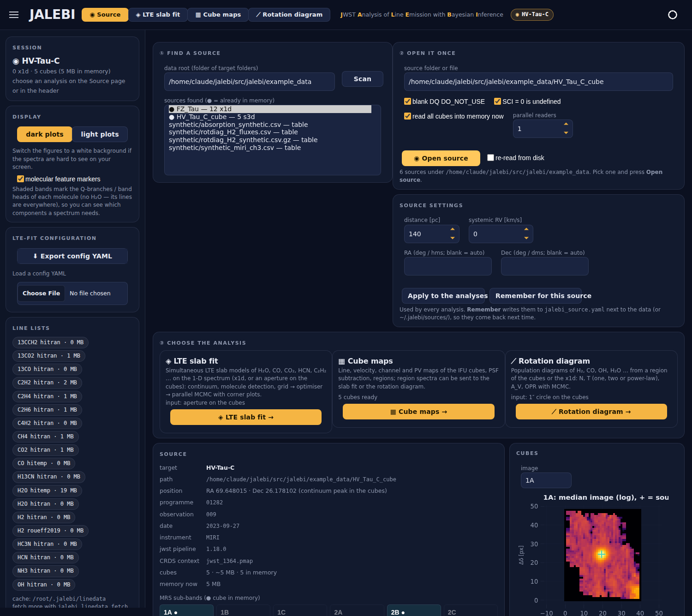

# Sources: open a target once, analyse it three ways

*JALEBI 0.14.0.* A **source** is one target folder of your reduced data — the pipeline `*_x1d.fits` of the 12 MRS
sub-bands and/or the `*_s3d.fits` cubes (a single cube, x1d file or CSV table works too). Every analysis starts from
it, so JALEBI reads it **once** and keeps it in memory.

<p align="center"></p>

## In the web app

```bash
jalebi serve --data-root /data/YSOs_MIRI_reduced_cube_data_Aug2026/disk_only --show
jalebi serve --source /data/.../V-HV-TAU-C_...          # open this one straight away
```

1. **① Find a source** — *Scan* lists every folder (two levels deep) with x1d or s3d files, and spectrum tables.
   `●` marks sources already in the server's memory.
2. **② Open it once** — reads the headers and the x1d; with *read all cubes into memory now* the cubes are read by
   *parallel readers* (threads); then the source is located in the cubes (continuum peak near `TARG_RA/TARG_DEC`).
   Typical full MRS set: 12 cubes, 200–400 MB, a few seconds on an SSD.
3. **Source settings** — distance, systemic RV and, if needed, your own RA/Dec (e.g. one component of a binary).
   *Apply* hands them to every analysis; *Remember* also writes `jalebi_source.yaml` next to the data (or to
   `~/.jalebi/sources/` when the data folder is read-only), so they come back next time.
4. **③ Choose the analysis** — each one gets the data from memory:

| analysis | what it receives |
| --- | --- |
| LTE slab fit | the x1d (or, without x1d, a 1.5 FWHM aperture on the cubes; switch in *Data → Extraction*) |
| Cube maps | the cubes (same `CubeSet` object: no second read) |
| Rotation diagram | a 1″ circle on the cubes at the source (extended H₂ kept, no background), or the x1d |

Switching analyses, re-opening the page or a second browser tab reuses the open source. Sending a cube region to the
slab fit or the rotation diagram works as before.

## Memory

| variable | default | meaning |
| --- | --- | --- |
| `JALEBI_SOURCE_CACHE` | 3 | sources kept per server process (least recently used dropped) |
| `JALEBI_CUBE_CACHE_MB` | 6000 | above this the cubes are not preloaded but read when needed (a few kept) |

The DQ and "SCI = 0 is undefined" choices are part of a source's identity: changing them opens the cubes again.

## From Python and the terminal

```python
from jalebi.source import open_source, scan_sources
from jalebi.cube import offset_region

src = open_source("/data/.../V-HV-TAU-C_...")
src.preload(workers=6)
print(src.describe())
spec = src.spectrum("x1d")                                     # or "s3d" with dict(aperture_fwhm_scale=1.5, apcorr="mrs")
reg = offset_region("circle", src.position()[:2], 0, 0, 1.0)
h2 = src.region_spectrum(reg)                                  # memoised; returned as a copy
src.save_settings(distance_pc=140, rv_kms=16)
```

```bash
jalebi source list /data/.../disk_only
jalebi source info /data/.../V-HV-TAU-C_... --preload --workers 6
jalebi source set  /data/.../V-HV-TAU-C_... --distance 140 --rv 16
jalebi source spectrum /data/.../V-HV-TAU-C_... hvtauc_aperture.csv --source s3d
```

`Source.aperture_spectrum` is the photometry of `jalebi.data.load_s3d_folder` on the cubes in memory (identical on the
bundled cubes; `tests/test_source.py`). The CLI fit, cube and rotation-diagram commands are unchanged.
